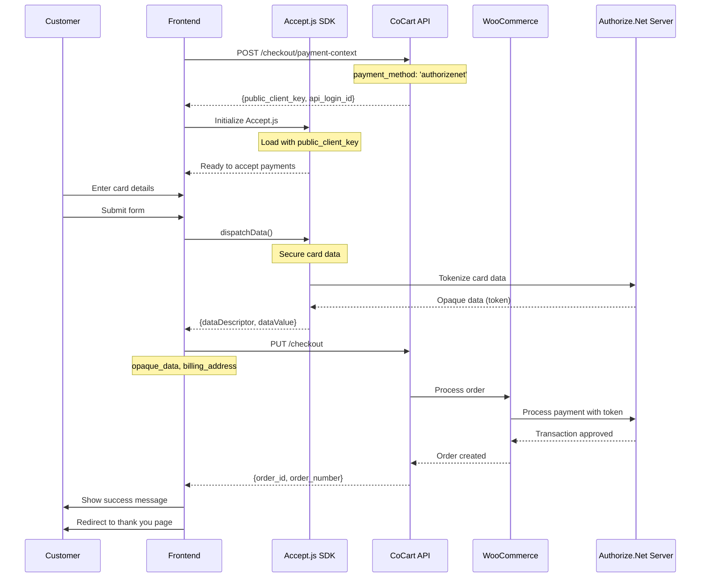

<Warning>
    This tutorial was written by [Claude Code (an AI)](https://claude.com/product/claude-code) and has not yet been reviewed. Follow along with caution. If the tutorial was helpful or a specific part was not clear/correct, please provide feedback at the bottom of the page. Thank you.
</Warning>

<Note>
    This guide covers integrating Authorize.Net with CoCart Preview API. Requires CoCart v4.6+ and a configured Authorize.Net payment gateway.
</Note>

## Overview

Authorize.Net integration with CoCart uses Accept.js for secure tokenization of payment data. This ensures sensitive card information never touches your server while providing PCI DSS compliance and fraud protection.

## Prerequisites

Before implementing Authorize.Net checkout, ensure you have:

1. Authorize.Net payment gateway configured in WooCommerce
2. Accept.js library loaded in your frontend
3. A valid cart with items added
4. Customer billing address information
5. API Login ID and Public Client Key from Authorize.Net

## Integration Flow



<Steps>
  <Step title="Load Accept.js Library">
    Initialize Accept.js with your store's public client key
  </Step>
  <Step title="Collect Payment Details">
    Securely collect card information from customers using form validation
  </Step>
  <Step title="Tokenize Payment Data">
    Use Accept.js to create secure payment nonce tokens
  </Step>
  <Step title="Complete Checkout">
    Submit checkout with payment nonce to CoCart for processing
  </Step>
</Steps>

## Step 1: Load Accept.js Library

Include the Accept.js library in your checkout page:

```html
<script type="text/javascript"
        src="https://js.authorize.net/v1/Accept.js"
        charset="utf-8">
</script>

<!-- For sandbox testing, use: -->
<!-- <script type="text/javascript"
          src="https://jstest.authorize.net/v1/Accept.js"
          charset="utf-8">
     </script> -->
```

## Step 2: Initialize Accept.js

Set up Accept.js with your store's configuration:

<Tabs>
  <Tab title="JavaScript">
    ```javascript
    // Initialize Accept.js with your store's credentials
    const acceptJSConfig = {
        // Must match WooCommerce Authorize.Net settings
        clientKey: 'your_public_client_key', // From Authorize.Net merchant account
        apiLoginID: 'your_api_login_id',     // From Authorize.Net merchant account
        environment: 'sandbox' // or 'production' based on your store settings
    };

    // Validate Accept.js library is loaded
    if (typeof Accept === 'undefined') {
        throw new Error('Accept.js library not loaded. Please include the script.');
    }

    console.log('Accept.js initialized successfully');
    ```
  </Tab>

  <Tab title="HTML">
    ```html
    <!-- Load Accept.js library -->
    <script type="text/javascript"
            src="https://jstest.authorize.net/v1/Accept.js"
            charset="utf-8">
    </script>

    <!-- For production, use: -->
    <!-- <script type="text/javascript"
              src="https://js.authorize.net/v1/Accept.js"
              charset="utf-8">
     </script> -->
    ```
  </Tab>
</Tabs>

<Warning>
**Important**: Your Accept.js configuration (client key, API login ID, environment) must exactly match your WooCommerce Authorize.Net gateway settings.
</Warning>

## Step 3: HTML Structure

Create a checkout form with secure payment fields:

```html
<form id="checkout-form">
    <!-- Customer Information -->
    <div class="billing-section">
        <h3>Billing Information</h3>
        <input type="text" name="billing_first_name" placeholder="First Name" required>
        <input type="text" name="billing_last_name" placeholder="Last Name" required>
        <input type="email" name="billing_email" placeholder="Email" required>
        <input type="tel" name="billing_phone" placeholder="Phone">
        <input type="text" name="billing_address_1" placeholder="Address" required>
        <input type="text" name="billing_city" placeholder="City" required>
        <input type="text" name="billing_state" placeholder="State" required>
        <input type="text" name="billing_postcode" placeholder="ZIP Code" required>
        <select name="billing_country" required>
            <option value="US">United States</option>
            <!-- Add other countries -->
        </select>
    </div>

    <!-- Payment Information -->
    <div class="payment-section">
        <h3>Payment Information</h3>

        <!-- Credit Card Fields -->
        <div class="card-fields">
            <input type="text"
                   id="card-number"
                   name="cardNumber"
                   placeholder="Card Number"
                   maxlength="20"
                   autocomplete="cc-number"
                   required>

            <div class="card-row">
                <input type="text"
                       id="expiry-month"
                       name="expMonth"
                       placeholder="MM"
                       maxlength="2"
                       autocomplete="cc-exp-month"
                       required>

                <input type="text"
                       id="expiry-year"
                       name="expYear"
                       placeholder="YYYY"
                       maxlength="4"
                       autocomplete="cc-exp-year"
                       required>

                <input type="text"
                       id="cvv"
                       name="cardCode"
                       placeholder="CVV"
                       maxlength="4"
                       autocomplete="cc-csc"
                       required>
            </div>
        </div>

        <div id="authorizenet-error-message" class="error-message" style="display: none;"></div>
    </div>

    <button type="submit" id="submit-button">
        <span id="button-text">Complete Order</span>
        <span id="button-spinner" class="spinner" style="display: none;"></span>
    </button>
</form>
```

## Step 4: Initialize Accept.js and Handle Form

Set up Accept.js with payment processing:

```javascript
async function setupAuthorizeNetCheckout() {
    try {
        // Create payment context
        const context = await createAuthorizeNetPaymentContext();

        // Store context for later use
        window.authorizeNetContext = context;

        // Setup form submission
        setupFormSubmission(context);

        // Setup card number formatting
        setupCardFormatting();

        console.log('Authorize.Net checkout initialized successfully');

    } catch (error) {
        console.error('Authorize.Net setup error:', error);
        showError('Payment setup failed. Please refresh and try again.');
    }
}

function setupFormSubmission(context) {
    const form = document.getElementById('checkout-form');
    const submitButton = document.getElementById('submit-button');
    const buttonText = document.getElementById('button-text');
    const buttonSpinner = document.getElementById('button-spinner');

    form.addEventListener('submit', async (event) => {
        event.preventDefault();

        // Disable submit button
        submitButton.disabled = true;
        buttonText.textContent = 'Processing...';
        buttonSpinner.style.display = 'inline-block';

        try {
            // Validate form
            if (!validateForm()) {
                throw new Error('Please fill in all required fields correctly.');
            }

            // Get form data
            const formData = new FormData(form);
            const billingAddress = getBillingAddressFromForm(formData);

            // Tokenize payment data
            const paymentData = await tokenizePaymentData(context, formData);

            // Process checkout
            await processAuthorizeNetCheckout(billingAddress, paymentData);

        } catch (error) {
            console.error('Checkout error:', error);
            showError(error.message || 'Checkout failed. Please try again.');
        } finally {
            // Re-enable submit button
            submitButton.disabled = false;
            buttonText.textContent = 'Complete Order';
            buttonSpinner.style.display = 'none';
        }
    });
}
```

## Step 5: Tokenize Payment Data with Accept.js

Use Accept.js to securely tokenize the payment information:

```javascript
function tokenizePaymentData(context, formData) {
    return new Promise((resolve, reject) => {
        // Prepare payment data for Accept.js
        const authData = {
            clientKey: context.public_client_key,
            apiLoginID: context.api_login_id
        };

        const cardData = {
            cardNumber: formData.get('cardNumber').replace(/\s/g, ''), // Remove spaces
            month: formData.get('expMonth').padStart(2, '0'), // Ensure 2 digits
            year: formData.get('expYear'),
            cardCode: formData.get('cardCode')
        };

        // Create secure data object
        const secureData = {
            authData: authData,
            cardData: cardData
        };

        // Call Accept.js to tokenize the data
        Accept.dispatchData(secureData, function(response) {
            if (response.messages.resultCode === 'Error') {
                // Handle tokenization errors
                const errorMessage = response.messages.message.map(msg => msg.text).join(', ');
                reject(new Error(`Payment validation failed: ${errorMessage}`));
            } else {
                // Success - return the opaque data
                resolve({
                    data_descriptor: response.opaqueData.dataDescriptor,
                    data_value: response.opaqueData.dataValue,
                    // Include card info for reference (last 4 digits only)
                    card_last_four: cardData.cardNumber.slice(-4),
                    card_type: getCardType(cardData.cardNumber),
                    expiry_month: cardData.month,
                    expiry_year: cardData.year
                });
            }
        });
    });
}

// Helper function to determine card type
function getCardType(cardNumber) {
    const number = cardNumber.replace(/\s/g, '');

    if (/^4/.test(number)) return 'visa';
    if (/^5[1-5]/.test(number) || /^2[2-7]/.test(number)) return 'mastercard';
    if (/^3[47]/.test(number)) return 'amex';
    if (/^6(?:011|5)/.test(number)) return 'discover';

    return 'unknown';
}
```

## Step 6: Process Checkout

Submit the checkout with tokenized payment data:

```javascript
async function processAuthorizeNetCheckout(billingAddress, paymentData) {
    const cartKey = localStorage.getItem('cart_key');

    const checkoutData = {
        billing_address: billingAddress,
        payment_method: 'authorizenet',
        payment_data: paymentData
    };

    const response = await fetch('https://yoursite.com/wp-json/cocart/preview/checkout', {
        method: 'PUT',
        headers: {
            'Cart-Key': cartKey,
            'Content-Type': 'application/json',
        },
        body: JSON.stringify(checkoutData)
    });

    const result = await response.json();

    if (!response.ok) {
        // Handle specific Authorize.Net errors
        if (result.data?.gateway_error) {
            throw new AuthorizeNetError(result.data.gateway_error);
        }
        throw new Error(result.message || `HTTP ${response.status}`);
    }

    // Handle successful checkout
    if (result.order_id) {
        showSuccess(`Order #${result.order_number} completed successfully!`);

        // Clear sensitive form data
        clearPaymentForm();

        // Clear cart
        localStorage.removeItem('cart_key');

        // Redirect to thank you page
        if (result.payment_result?.redirect_url) {
            setTimeout(() => {
                window.location.href = result.payment_result.redirect_url;
            }, 2000);
        }
    }

    return result;
}

// Custom error class for Authorize.Net errors
class AuthorizeNetError extends Error {
    constructor(gatewayError) {
        super(gatewayError.message || 'Payment processing failed');
        this.code = gatewayError.code;
        this.reasonCode = gatewayError.reason_code;
        this.reasonText = gatewayError.reason_text;
    }

    getDisplayMessage() {
        // Return user-friendly error messages based on reason codes
        switch (this.reasonCode) {
            case '2':
                return 'Transaction declined. Please try a different card.';
            case '3':
                return 'Transaction error. Please try again.';
            case '4':
                return 'Card declined. Please contact your card issuer.';
            case '5':
                return 'Invalid amount. Please try again.';
            case '6':
                return 'Invalid credit card number.';
            case '7':
                return 'Invalid expiration date.';
            case '8':
                return 'Card has expired. Please use a different card.';
            case '11':
                return 'Duplicate transaction detected.';
            case '13':
                return 'Merchant account does not accept this card type.';
            case '17':
                return 'Merchant account cannot accept this card.';
            case '27':
                return 'Transaction resulted in an AVS mismatch.';
            case '28':
                return 'Merchant account does not accept this card type.';
            default:
                return this.reasonText || this.message;
        }
    }
}
```

## Complete Integration Example

Here's a complete working implementation:

```javascript
class AuthorizeNetCheckout {
    constructor() {
        this.context = null;
        this.formValid = false;
    }

    async initialize() {
        try {
            // Create payment context
            this.context = await this.createPaymentContext();

            // Setup form validation
            this.setupFormValidation();

            // Setup form submission
            this.setupFormSubmission();

            // Setup card formatting
            this.setupCardFormatting();

            console.log('Authorize.Net checkout initialized successfully');
        } catch (error) {
            console.error('Authorize.Net initialization error:', error);
            this.showError('Payment system unavailable. Please try again later.');
        }
    }

    async createPaymentContext() {
        const cartKey = localStorage.getItem('cart_key');

        const response = await fetch('/wp-json/cocart/preview/checkout/payment-context', {
            method: 'POST',
            headers: {
                'Cart-Key': cartKey,
                'Content-Type': 'application/json',
            },
            body: JSON.stringify({ payment_method: 'authorizenet' })
        });

        const context = await response.json();

        if (!response.ok) {
            throw new Error(context.message || 'Failed to create payment context');
        }

        return context;
    }

    setupFormValidation() {
        const form = document.getElementById('checkout-form');
        const requiredFields = form.querySelectorAll('input[required]');

        const validateForm = () => {
            let isValid = true;

            // Validate required fields
            requiredFields.forEach(field => {
                if (!field.value.trim()) {
                    isValid = false;
                    field.classList.add('error');
                } else {
                    field.classList.remove('error');
                }
            });

            // Validate card number
            const cardNumber = document.getElementById('card-number').value.replace(/\s/g, '');
            if (!this.isValidCardNumber(cardNumber)) {
                isValid = false;
                document.getElementById('card-number').classList.add('error');
            }

            // Validate expiry
            const month = document.getElementById('expiry-month').value;
            const year = document.getElementById('expiry-year').value;
            if (!this.isValidExpiry(month, year)) {
                isValid = false;
                document.getElementById('expiry-month').classList.add('error');
                document.getElementById('expiry-year').classList.add('error');
            }

            // Validate CVV
            const cvv = document.getElementById('cvv').value;
            if (!this.isValidCvv(cvv, cardNumber)) {
                isValid = false;
                document.getElementById('cvv').classList.add('error');
            }

            this.formValid = isValid;
            return isValid;
        };

        // Add event listeners
        requiredFields.forEach(field => {
            field.addEventListener('blur', validateForm);
            field.addEventListener('input', validateForm);
        });

        // Initial validation
        validateForm();
    }

    setupCardFormatting() {
        const cardNumberField = document.getElementById('card-number');

        cardNumberField.addEventListener('input', (e) => {
            let value = e.target.value.replace(/\s/g, '').replace(/[^0-9]/gi, '');
            let formattedValue = value.match(/.{1,4}/g)?.join(' ') || value;

            if (formattedValue !== e.target.value) {
                e.target.value = formattedValue;
            }
        });

        // Auto-advance fields
        const monthField = document.getElementById('expiry-month');
        const yearField = document.getElementById('expiry-year');
        const cvvField = document.getElementById('cvv');

        monthField.addEventListener('input', (e) => {
            if (e.target.value.length === 2) {
                yearField.focus();
            }
        });

        yearField.addEventListener('input', (e) => {
            if (e.target.value.length === 4) {
                cvvField.focus();
            }
        });
    }

    setupFormSubmission() {
        const form = document.getElementById('checkout-form');

        form.addEventListener('submit', async (event) => {
            event.preventDefault();

            const submitButton = form.querySelector('[type="submit"]');
            const originalText = submitButton.textContent;

            try {
                submitButton.disabled = true;
                submitButton.textContent = 'Processing...';

                if (!this.formValid) {
                    throw new Error('Please correct the errors in your form.');
                }

                const formData = new FormData(form);
                const billingAddress = this.getBillingAddressFromForm(formData);

                // Tokenize payment data
                const paymentData = await this.tokenizePaymentData(formData);

                // Process checkout
                await this.processCheckout(billingAddress, paymentData);

            } catch (error) {
                console.error('Checkout error:', error);

                if (error instanceof AuthorizeNetError) {
                    this.showError(error.getDisplayMessage());
                } else {
                    this.showError(error.message || 'Checkout failed. Please try again.');
                }
            } finally {
                submitButton.disabled = false;
                submitButton.textContent = originalText;
            }
        });
    }

    tokenizePaymentData(formData) {
        return new Promise((resolve, reject) => {
            const authData = {
                clientKey: this.context.public_client_key,
                apiLoginID: this.context.api_login_id
            };

            const cardData = {
                cardNumber: formData.get('cardNumber').replace(/\s/g, ''),
                month: formData.get('expMonth').padStart(2, '0'),
                year: formData.get('expYear'),
                cardCode: formData.get('cardCode')
            };

            const secureData = { authData, cardData };

            Accept.dispatchData(secureData, (response) => {
                if (response.messages.resultCode === 'Error') {
                    const errorMessage = response.messages.message
                        .map(msg => msg.text)
                        .join(', ');
                    reject(new Error(`Payment validation failed: ${errorMessage}`));
                } else {
                    resolve({
                        data_descriptor: response.opaqueData.dataDescriptor,
                        data_value: response.opaqueData.dataValue,
                        card_last_four: cardData.cardNumber.slice(-4),
                        card_type: this.getCardType(cardData.cardNumber),
                        expiry_month: cardData.month,
                        expiry_year: cardData.year
                    });
                }
            });
        });
    }

    async processCheckout(billingAddress, paymentData) {
        const cartKey = localStorage.getItem('cart_key');

        const response = await fetch('/wp-json/cocart/preview/checkout', {
            method: 'PUT',
            headers: {
                'Cart-Key': cartKey,
                'Content-Type': 'application/json',
            },
            body: JSON.stringify({
                billing_address: billingAddress,
                payment_method: 'authorizenet',
                payment_data: paymentData
            })
        });

        const result = await response.json();

        if (!response.ok) {
            if (result.data?.gateway_error) {
                throw new AuthorizeNetError(result.data.gateway_error);
            }
            throw new Error(result.message || `HTTP ${response.status}`);
        }

        this.handleCheckoutSuccess(result);
        return result;
    }

    getBillingAddressFromForm(formData) {
        return {
            first_name: formData.get('billing_first_name'),
            last_name: formData.get('billing_last_name'),
            email: formData.get('billing_email'),
            phone: formData.get('billing_phone'),
            address_1: formData.get('billing_address_1'),
            city: formData.get('billing_city'),
            state: formData.get('billing_state'),
            postcode: formData.get('billing_postcode'),
            country: formData.get('billing_country')
        };
    }

    handleCheckoutSuccess(result) {
        this.showSuccess(`Order #${result.order_number} completed successfully!`);

        // Clear sensitive form data
        this.clearPaymentForm();

        // Clear cart
        localStorage.removeItem('cart_key');

        // Redirect after delay
        if (result.payment_result?.redirect_url) {
            setTimeout(() => {
                window.location.href = result.payment_result.redirect_url;
            }, 2000);
        }
    }

    clearPaymentForm() {
        document.getElementById('card-number').value = '';
        document.getElementById('expiry-month').value = '';
        document.getElementById('expiry-year').value = '';
        document.getElementById('cvv').value = '';
    }

    // Validation methods
    isValidCardNumber(cardNumber) {
        // Luhn algorithm validation
        if (!/^\d+$/.test(cardNumber) || cardNumber.length < 13) return false;

        let sum = 0;
        let isEven = false;

        for (let i = cardNumber.length - 1; i >= 0; i--) {
            let digit = parseInt(cardNumber.charAt(i), 10);

            if (isEven) {
                digit *= 2;
                if (digit > 9) {
                    digit -= 9;
                }
            }

            sum += digit;
            isEven = !isEven;
        }

        return sum % 10 === 0;
    }

    isValidExpiry(month, year) {
        if (!/^\d{1,2}$/.test(month) || !/^\d{4}$/.test(year)) return false;

        const expiry = new Date(parseInt(year), parseInt(month) - 1);
        const now = new Date();
        now.setDate(1); // Set to first day of current month

        return expiry >= now;
    }

    isValidCvv(cvv, cardNumber) {
        if (!/^\d+$/.test(cvv)) return false;

        // American Express uses 4-digit CVV
        if (this.getCardType(cardNumber) === 'amex') {
            return cvv.length === 4;
        }

        return cvv.length === 3;
    }

    getCardType(cardNumber) {
        const number = cardNumber.replace(/\s/g, '');

        if (/^4/.test(number)) return 'visa';
        if (/^5[1-5]/.test(number) || /^2[2-7]/.test(number)) return 'mastercard';
        if (/^3[47]/.test(number)) return 'amex';
        if (/^6(?:011|5)/.test(number)) return 'discover';

        return 'unknown';
    }

    showError(message) {
        const errorElement = document.getElementById('authorizenet-error-message');
        errorElement.textContent = message;
        errorElement.style.display = 'block';
        errorElement.className = 'error-message';
    }

    showSuccess(message) {
        const errorElement = document.getElementById('authorizenet-error-message');
        errorElement.textContent = message;
        errorElement.style.display = 'block';
        errorElement.className = 'success-message';
    }
}

// Initialize when DOM is loaded
document.addEventListener('DOMContentLoaded', async () => {
    const checkout = new AuthorizeNetCheckout();
    await checkout.initialize();
});
```

## Error Handling

Handle common Authorize.Net error scenarios:

```javascript
function handleAuthorizeNetErrors(error) {
    // Common Authorize.Net response codes
    const errorMessages = {
        '1': 'Transaction approved',
        '2': 'Transaction declined',
        '3': 'Transaction error',
        '4': 'Transaction held for review',

        // Specific decline reasons
        '6': 'Invalid credit card number',
        '7': 'Invalid expiration date',
        '8': 'Credit card has expired',
        '11': 'Duplicate transaction',
        '13': 'Merchant does not accept this card type',
        '17': 'Merchant cannot accept this card',
        '19': 'Transaction cannot be processed',
        '27': 'Address verification failed',
        '28': 'Card type not accepted by merchant',
        '44': 'Card code verification failed',
        '45': 'Card code and address verification failed'
    };

    const reasonCode = error.reasonCode || error.code;
    return errorMessages[reasonCode] || error.message || 'Payment processing failed';
}
```

## Testing

For development and testing with Authorize.Net:

### Test Card Numbers
- **Visa**: `4007000000027`
- **MasterCard**: `5424000000000015`
- **American Express**: `374200000000004`
- **Discover**: `6011000000000012`

### Test Scenarios
- **Declined transaction**: Use amount `$0.01`
- **Error transaction**: Use amount `$0.02`
- **Held transaction**: Use amount `$0.03`

## Troubleshooting

### Common Issues

<AccordionGroup>
    <Accordion title="Accept.js Library Not Loading">
        **Problem**: Accept.js is undefined or not loading.

        **Solution**: Verify script is loaded correctly:
        ```javascript
        // Check if Accept.js is available
        if (typeof Accept === 'undefined') {
            console.error('Accept.js not loaded');
            console.error('Check script tag is present and correct');
        }

        // Correct script tag for production
        <script type="text/javascript"
                src="https://js.authorize.net/v1/Accept.js"
                charset="utf-8">
        </script>

        // For sandbox testing
        <script type="text/javascript"
                src="https://jstest.authorize.net/v1/Accept.js"
                charset="utf-8">
        </script>
        ```
        Common causes:
        - Wrong URL (production vs sandbox)
        - Script blocked by ad blocker or firewall
        - CORS or Content Security Policy issues
        - Network timeout loading external script
    </Accordion>

    <Accordion title="Tokenization Fails with Error Messages">
        **Problem**: Getting errors when calling Accept.dispatchData().

        **Solution**: Handle Accept.js error responses:
        ```javascript
        Accept.dispatchData(secureData, function(response) {
            if (response.messages.resultCode === 'Error') {
                // Log all error messages
                response.messages.message.forEach(function(msg) {
                    console.error('Error:', msg.code, msg.text);

                    // Common error codes
                    switch(msg.code) {
                        case 'E_WC_05':
                            showError('Invalid card number');
                            break;
                        case 'E_WC_06':
                            showError('Invalid expiration date');
                            break;
                        case 'E_WC_07':
                            showError('Card has expired');
                            break;
                        case 'E_WC_08':
                            showError('Invalid CVV');
                            break;
                        case 'E_WC_15':
                            showError('Invalid client key or API login ID');
                            break;
                        default:
                            showError(msg.text);
                    }
                });
            } else {
                // Success - use response.opaqueData
                console.log('Token:', response.opaqueData.dataValue);
            }
        });
        ```
        Verification checklist:
        - Card number is valid (use Luhn algorithm)
        - Expiration date is in future (MM/YYYY format)
        - CVV is 3-4 digits
        - Client key and API login ID are correct
        - All required fields are provided
    </Accordion>

    <Accordion title="Invalid Client Key or API Login ID">
        **Problem**: Authentication errors when tokenizing.

        **Solution**: Verify credentials match your environment:
        ```javascript
        // Credentials MUST match WooCommerce settings exactly
        const authData = {
            clientKey: 'YOUR_PUBLIC_CLIENT_KEY',  // From Authorize.Net account
            apiLoginID: 'YOUR_API_LOGIN_ID'        // From Authorize.Net account
        };

        // Check which environment you're using
        console.log('Using sandbox URL?',
            document.querySelector('script[src*="jstest.authorize.net"]') !== null
        );
        ```
        Steps to verify:
        1. Log into Authorize.Net Merchant Interface
        2. Go to Account → Settings → API Credentials & Keys
        3. For sandbox: use test API credentials
        4. For production: use live API credentials
        5. Ensure WooCommerce Authorize.Net settings match
        6. Client key format: starts with numbers and letters
        7. API Login ID: alphanumeric string
    </Accordion>

    <Accordion title="Opaque Data Not Being Accepted">
        **Problem**: Backend rejects the opaque data token.

        **Solution**: Ensure proper data format:
        ```javascript
        // Accept.js returns opaqueData
        const opaqueData = response.opaqueData;

        // Must send BOTH dataDescriptor and dataValue
        const paymentData = {
            data_descriptor: opaqueData.dataDescriptor,  // e.g., "COMMON.ACCEPT.INAPP.PAYMENT"
            data_value: opaqueData.dataValue,             // The actual token
            // Optional but recommended
            card_last_four: cardNumber.slice(-4),
            card_type: getCardType(cardNumber),
            expiry_month: expMonth,
            expiry_year: expYear
        };

        // Submit to CoCart
        const checkoutData = {
            billing_address: billingAddress,
            payment_method: 'authorizenet',
            payment_data: paymentData
        };
        ```
        Common mistakes:
        - Only sending dataValue without dataDescriptor
        - Trying to reuse an expired token (tokens expire quickly)
        - Sending raw card data instead of opaque data
        - Wrong payment_method ID (must be 'authorizenet')
    </Accordion>

    <Accordion title="Transaction Declined with Reason Codes">
        **Problem**: Transactions are being declined.

        **Solution**: Handle specific decline codes:
        ```javascript
        // Authorize.Net returns reason codes for declines
        function handleAuthorizeNetError(error) {
            const reasonCode = error.reason_code || error.code;

            const errorMessages = {
                '2': 'Transaction declined',
                '3': 'Error processing transaction',
                '4': 'Transaction held for review',
                '6': 'Invalid credit card number',
                '7': 'Invalid expiration date',
                '8': 'Card has expired',
                '11': 'Duplicate transaction',
                '13': 'Merchant does not accept this card type',
                '27': 'Address verification (AVS) failed',
                '28': 'Card type not accepted',
                '44': 'Card code (CVV) does not match',
                '45': 'CVV and AVS both failed',
                '127': 'Transaction did not meet AVS requirements',
                '193': 'Country not supported'
            };

            return errorMessages[reasonCode] || 'Transaction failed';
        }
        ```
        Testing declines:
        - Use test amounts ($0.01, $0.02, $0.03) in sandbox
        - Check AVS settings in Authorize.Net dashboard
        - Verify CVV verification is properly configured
        - Review fraud detection rules
    </Accordion>

    <Accordion title="Sandbox vs Production Configuration">
        **Problem**: Works in sandbox but fails in production.

        **Solution**: Verify environment configuration:
        ```javascript
        // Sandbox configuration
        const sandboxConfig = {
            scriptUrl: 'https://jstest.authorize.net/v1/Accept.js',
            apiLoginID: 'sandbox_api_login',
            clientKey: 'sandbox_public_key',
            endpoint: 'apitest.authorize.net'
        };

        // Production configuration
        const productionConfig = {
            scriptUrl: 'https://js.authorize.net/v1/Accept.js',
            apiLoginID: 'production_api_login',
            clientKey: 'production_public_key',
            endpoint: 'api.authorize.net'
        };
        ```
        Pre-launch checklist:
        - [ ] Switch Accept.js URL from jstest to js
        - [ ] Update API Login ID to production credentials
        - [ ] Update Public Client Key to production key
        - [ ] Update WooCommerce settings to production mode
        - [ ] Test with real card (small amount)
        - [ ] Verify SSL certificate is valid
        - [ ] Enable production transaction mode
        - [ ] Configure webhooks for production
        - [ ] Set up email notifications
    </Accordion>

    <Accordion title="Payment Method Not Recognized">
        **Problem**: Backend returns "payment method not available" error.

        **Solution**: Verify payment method configuration:
        ```javascript
        // Correct payment method ID for Authorize.Net
        const checkoutData = {
            billing_address: billingAddress,
            payment_method: 'authorizenet', // Must match WooCommerce gateway ID
            payment_data: {
                data_descriptor: opaqueData.dataDescriptor,
                data_value: opaqueData.dataValue
            }
        };
        ```
        Checklist:
        - Payment method ID is 'authorizenet' (check WooCommerce gateway settings)
        - Authorize.Net gateway is enabled in WooCommerce → Settings → Payments
        - Gateway is properly configured with valid credentials
        - Currency is supported by Authorize.Net
        - Account is active and in good standing
    </Accordion>

    <Accordion title="Form Validation Not Working">
        **Problem**: Unable to validate card input before tokenization.

        **Solution**: Implement client-side validation:
        ```javascript
        // Validate card number (Luhn algorithm)
        function isValidCardNumber(cardNumber) {
            const digits = cardNumber.replace(/\D/g, '');
            if (digits.length < 13 || digits.length > 19) return false;

            let sum = 0;
            let isEven = false;

            for (let i = digits.length - 1; i >= 0; i--) {
                let digit = parseInt(digits[i]);

                if (isEven) {
                    digit *= 2;
                    if (digit > 9) digit -= 9;
                }

                sum += digit;
                isEven = !isEven;
            }

            return sum % 10 === 0;
        }

        // Validate expiration date
        function isValidExpiry(month, year) {
            const expiry = new Date(parseInt(year), parseInt(month) - 1);
            const now = new Date();
            now.setDate(1); // Set to first of month for comparison

            return expiry >= now;
        }

        // Validate CVV
        function isValidCVV(cvv, cardType) {
            const cvvLength = cvv.replace(/\D/g, '').length;
            return cardType === 'amex' ? cvvLength === 4 : cvvLength === 3;
        }

        // Use before calling Accept.dispatchData
        if (!isValidCardNumber(cardNumber)) {
            showError('Invalid card number');
            return;
        }
        ```
    </Accordion>

    <Accordion title="Checkout Completes But Order Not Created">
        **Problem**: Payment authorized but WooCommerce order fails.

        **Solution**: Debug the checkout submission:
        ```javascript
        async function processCheckout(billingAddress, paymentData) {
            try {
                console.log('Submitting checkout...');
                console.log('Billing:', billingAddress);
                console.log('Payment data:', paymentData);

                const response = await fetch('/wp-json/cocart/preview/checkout', {
                    method: 'PUT',
                    headers: {
                        'Cart-Key': cartKey,
                        'Content-Type': 'application/json',
                    },
                    body: JSON.stringify({
                        billing_address: billingAddress,
                        payment_method: 'authorizenet',
                        payment_data: paymentData
                    })
                });

                const result = await response.json();
                console.log('Checkout response:', result);

                if (!response.ok) {
                    console.error('HTTP Error:', response.status);
                    throw new Error(result.message || 'Checkout failed');
                }

                if (!result.order_id) {
                    console.error('No order ID returned');
                    throw new Error('Order creation failed');
                }

                return result;

            } catch (error) {
                console.error('Checkout error:', error);
                throw error;
            }
        }
        ```
        Debug checklist:
        - Check browser console for errors
        - Review server PHP error logs
        - Check WooCommerce → Status → Logs
        - Verify Authorize.Net transaction in merchant interface
        - Ensure cart is not empty
        - Validate all required billing fields are provided
    </Accordion>

    <Accordion title="CORS or Content Security Policy Errors">
        **Problem**: Browser blocks Accept.js or API calls.

        **Solution**: Configure CSP headers properly:
        ```html
        <!-- Required Content Security Policy directives -->
        <meta http-equiv="Content-Security-Policy"
              content="
                script-src 'self' https://js.authorize.net https://jstest.authorize.net;
                frame-src 'self' https://authorize.net https://test.authorize.net;
                connect-src 'self' https://api.authorize.net https://apitest.authorize.net;
              ">
        ```
        Or in server configuration:
        ```
        Content-Security-Policy:
          script-src 'self' https://js.authorize.net https://jstest.authorize.net;
          frame-src 'self' https://authorize.net https://test.authorize.net;
          connect-src 'self' https://api.authorize.net https://apitest.authorize.net;
        ```
        Also check:
        - Firewall not blocking authorize.net domains
        - No ad blockers interfering with payment scripts
        - HTTPS is properly configured (Accept.js requires HTTPS)
    </Accordion>
</AccordionGroup>

### Debug Mode

Enable detailed logging for troubleshooting:

```javascript
const DEBUG = true; // Set to false in production

if (DEBUG) {
    console.log('[Authorize.Net] Configuration:', {
        clientKey: authData.clientKey,
        apiLoginID: authData.apiLoginID,
        environment: window.location.hostname.includes('test') ? 'sandbox' : 'production'
    });

    // Log card data being sent (DO NOT log full card number in production)
    console.log('[Authorize.Net] Preparing to tokenize:', {
        cardNumberLength: cardData.cardNumber.length,
        lastFour: cardData.cardNumber.slice(-4),
        month: cardData.month,
        year: cardData.year,
        cvvLength: cardData.cardCode.length
    });

    // Wrap Accept.dispatchData with logging
    const originalDispatchData = Accept.dispatchData;
    Accept.dispatchData = function(secureData, callback) {
        console.log('[Authorize.Net] Calling Accept.dispatchData');

        originalDispatchData(secureData, function(response) {
            console.log('[Authorize.Net] Response received:', {
                resultCode: response.messages.resultCode,
                messageCount: response.messages.message.length
            });

            if (response.messages.resultCode === 'Ok') {
                console.log('[Authorize.Net] Token created successfully');
            } else {
                console.error('[Authorize.Net] Errors:', response.messages.message);
            }

            callback(response);
        });
    };
}
```

### Getting Help

If issues persist:

1. **Authorize.Net Documentation**: [Accept.js Integration Guide](https://developer.authorize.net/api/reference/features/acceptjs.html)
2. **Authorize.Net Support**: Contact through merchant interface
3. **Developer Forums**: [Authorize.Net Community](https://community.developer.authorize.net/)
4. **WooCommerce Logs**: Check WooCommerce → Status → Logs
5. **Transaction Details**: Review in Authorize.Net Merchant Interface

## Best Practices

<CardGroup cols={2}>
  <Card title="Security" icon="shield-check">
    - Always use Accept.js for tokenization
    - Never store raw card data
    - Use HTTPS for all requests
    - Implement proper form validation
    - Clear sensitive data after processing
  </Card>

  <Card title="User Experience" icon="user">
    - Format card numbers with spaces
    - Auto-advance between form fields
    - Show real-time validation errors
    - Provide clear error messages
    - Handle declined cards gracefully
  </Card>

  <Card title="Compliance" icon="certificate">
    - Follow PCI DSS guidelines
    - Use Accept.js for PCI compliance
    - Implement proper error handling
    - Log transactions for auditing
    - Test with various card types
  </Card>

  <Card title="Performance" icon="gauge-high">
    - Load Accept.js asynchronously
    - Cache payment contexts
    - Implement proper timeouts
    - Handle network failures
    - Monitor transaction success rates
  </Card>
</CardGroup>

## Advanced Features

### Customer Information Manager (CIM)

For storing customer payment methods:

```javascript
// When processing checkout with saved payment option
const paymentData = {
    customer_profile_id: 'CUSTOMER_PROFILE_ID',
    payment_profile_id: 'PAYMENT_PROFILE_ID',
    // Include CVV for saved cards
    card_code: formData.get('cardCode')
};
```

### Recurring Billing

For subscription payments:

```javascript
const paymentData = {
    data_descriptor: response.opaqueData.dataDescriptor,
    data_value: response.opaqueData.dataValue,
    subscription: {
        interval_length: 1,
        interval_unit: 'months',
        start_date: '2024-01-01',
        total_occurrences: 12
    }
};
```

<Note>
Always test your Authorize.Net integration thoroughly using the sandbox environment before going live. Ensure your webhook endpoints are configured to handle transaction notifications and updates.
</Note>