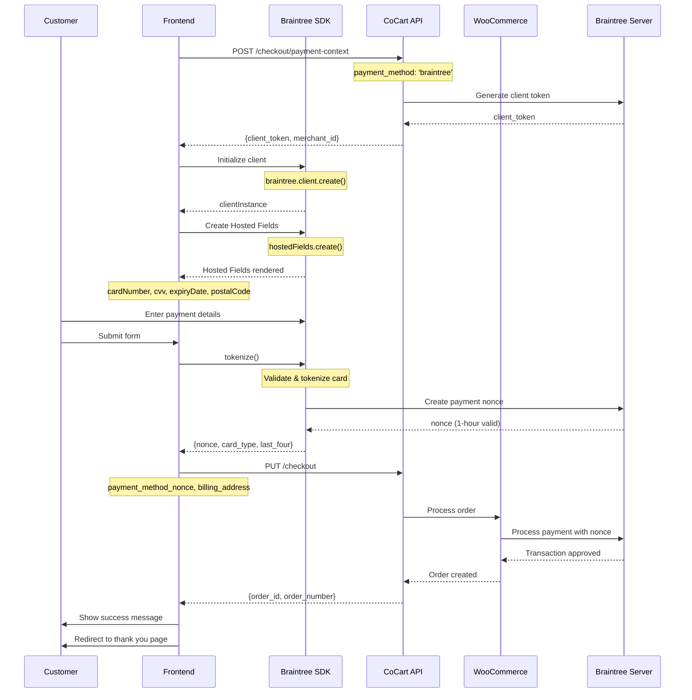

<Warning>
    This tutorial was written by [Claude Code (an AI)](https://claude.com/product/claude-code) and has not yet been reviewed. Follow along with caution. If the tutorial was helpful or a specific part was not clear/correct, please provide feedback at the bottom of the page. Thank you.
</Warning>

<Note>
    This guide covers integrating Braintree with CoCart Preview API. Requires CoCart v4.6+ and a configured Braintree payment gateway.
</Note>

## Overview

Braintree integration with CoCart uses Hosted Fields for secure tokenization of payment data. This ensures sensitive card information never touches your server while providing PCI DSS SAQ A compliance and PayPal's fraud protection.

Braintree (owned by PayPal) supports multiple payment methods including credit cards, PayPal, Venmo, Apple Pay, and Google Pay.

## Prerequisites

Before implementing Braintree checkout, ensure you have:

1. Braintree payment gateway configured in WooCommerce
2. Braintree JavaScript SDK (v3) loaded in your frontend
3. A valid cart with items added
4. Customer billing address information
5. Braintree sandbox or production credentials

## Integration Flow



<Steps>
  <Step title="Load Braintree SDK">
    Initialize the Braintree JavaScript SDK
  </Step>
  <Step title="Request Client Token">
    Obtain a client authorization token from your server
  </Step>
  <Step title="Initialize Hosted Fields">
    Create secure iframe-based payment input fields
  </Step>
  <Step title="Collect Payment Details">
    Securely collect card information from customers
  </Step>
  <Step title="Tokenize Payment Data">
    Generate a payment method nonce (temporary token)
  </Step>
  <Step title="Complete Checkout">
    Submit checkout with payment nonce to CoCart for processing
  </Step>
</Steps>

## Step 1: Load Braintree SDK

Include the Braintree Web SDK in your checkout page:

```html
<!-- Load Braintree JavaScript SDK v3 -->
<script src="https://js.braintreegateway.com/web/3.97.2/js/client.min.js"></script>
<script src="https://js.braintreegateway.com/web/3.97.2/js/hosted-fields.min.js"></script>

<!-- Optional: For PayPal, Venmo, or other payment methods -->
<!-- <script src="https://js.braintreegateway.com/web/3.97.2/js/paypal-checkout.min.js"></script> -->
<!-- <script src="https://js.braintreegateway.com/web/3.97.2/js/venmo.min.js"></script> -->
```

<Warning>
**Important**: Always use a specific version number in production. Check [Braintree's release notes](https://github.com/braintree/braintree-web/releases) for the latest stable version.
</Warning>

## Step 2: Request Client Token

Request a client authorization token from CoCart:

```javascript
async function createBraintreePaymentContext() {
    const cartKey = localStorage.getItem('cart_key');

    const response = await fetch('/wp-json/cocart/preview/checkout/payment-context', {
        method: 'POST',
        headers: {
            'Cart-Key': cartKey,
            'Content-Type': 'application/json',
        },
        body: JSON.stringify({
            payment_method: 'braintree'
        })
    });

    if (!response.ok) {
        const error = await response.json();
        throw new Error(error.message || 'Failed to create payment context');
    }

    const context = await response.json();

    // Context contains:
    // - client_token: Authorization token for Braintree SDK
    // - merchant_id: Your Braintree merchant ID
    // - environment: 'sandbox' or 'production'

    return context;
}
```

## Step 3: HTML Structure

Create a checkout form with containers for Hosted Fields:

```html
<form id="checkout-form">
    <!-- Customer Information -->
    <div class="billing-section">
        <h3>Billing Information</h3>
        <input type="text" name="billing_first_name" placeholder="First Name" required>
        <input type="text" name="billing_last_name" placeholder="Last Name" required>
        <input type="email" name="billing_email" placeholder="Email" required>
        <input type="tel" name="billing_phone" placeholder="Phone">
        <input type="text" name="billing_address_1" placeholder="Address" required>
        <input type="text" name="billing_city" placeholder="City" required>
        <input type="text" name="billing_state" placeholder="State" required>
        <input type="text" name="billing_postcode" placeholder="ZIP Code" required>
        <select name="billing_country" required>
            <option value="US">United States</option>
            <!-- Add other countries -->
        </select>
    </div>

    <!-- Payment Information -->
    <div class="payment-section">
        <h3>Payment Information</h3>

        <!-- Braintree Hosted Fields will be injected into these containers -->
        <div class="hosted-fields">
            <label for="card-number">Card Number</label>
            <div id="card-number" class="hosted-field"></div>

            <div class="card-row">
                <div class="field-group">
                    <label for="expiration-date">Expiration Date</label>
                    <div id="expiration-date" class="hosted-field"></div>
                </div>

                <div class="field-group">
                    <label for="cvv">CVV</label>
                    <div id="cvv" class="hosted-field"></div>
                </div>

                <div class="field-group">
                    <label for="postal-code">Postal Code</label>
                    <div id="postal-code" class="hosted-field"></div>
                </div>
            </div>
        </div>

        <div id="braintree-error-message" class="error-message" style="display: none;"></div>
    </div>

    <button type="submit" id="submit-button">
        <span id="button-text">Complete Order</span>
        <span id="button-spinner" class="spinner" style="display: none;"></span>
    </button>
</form>
```

## Step 4: Initialize Braintree Client

Initialize the Braintree client with your authorization token:

```javascript
async function setupBraintreeCheckout() {
    try {
        // Get payment context with client token
        const context = await createBraintreePaymentContext();

        // Create Braintree client
        const clientInstance = await braintree.client.create({
            authorization: context.client_token
        });

        console.log('Braintree client initialized');

        // Initialize Hosted Fields
        const hostedFieldsInstance = await setupHostedFields(clientInstance);

        // Setup form submission
        setupFormSubmission(hostedFieldsInstance);

        console.log('Braintree checkout initialized successfully');

    } catch (error) {
        console.error('Braintree setup error:', error);
        showError('Payment setup failed. Please refresh and try again.');
    }
}
```

## Step 5: Initialize Hosted Fields

Configure and create Hosted Fields for secure payment input:

```javascript
async function setupHostedFields(clientInstance) {
    const hostedFieldsInstance = await braintree.hostedFields.create({
        client: clientInstance,
        styles: {
            'input': {
                'font-size': '16px',
                'font-family': '-apple-system, BlinkMacSystemFont, "Segoe UI", Roboto, sans-serif',
                'color': '#3a3a3a'
            },
            'input.invalid': {
                'color': '#e53e3e'
            },
            'input.valid': {
                'color': '#38a169'
            },
            ':focus': {
                'color': '#2c5282'
            }
        },
        fields: {
            number: {
                selector: '#card-number',
                placeholder: '4111 1111 1111 1111',
                prefill: '' // Optional: Pre-fill for testing
            },
            cvv: {
                selector: '#cvv',
                placeholder: '123',
                maxlength: 4 // Supports 4-digit CVV for Amex
            },
            expirationDate: {
                selector: '#expiration-date',
                placeholder: 'MM/YY'
            },
            postalCode: {
                selector: '#postal-code',
                placeholder: '12345'
            }
        }
    });

    // Setup field validation event listeners
    setupFieldValidation(hostedFieldsInstance);

    return hostedFieldsInstance;
}

function setupFieldValidation(hostedFieldsInstance) {
    // Listen to field events for validation feedback
    hostedFieldsInstance.on('validityChange', function(event) {
        const field = event.fields[event.emittedBy];
        const fieldContainer = document.querySelector('#' + event.emittedBy).parentElement;

        if (field.isValid) {
            fieldContainer.classList.remove('invalid');
            fieldContainer.classList.add('valid');
        } else if (field.isPotentiallyValid) {
            fieldContainer.classList.remove('invalid', 'valid');
        } else {
            fieldContainer.classList.remove('valid');
            fieldContainer.classList.add('invalid');
        }
    });

    // Detect card type
    hostedFieldsInstance.on('cardTypeChange', function(event) {
        if (event.cards.length === 1) {
            const cardType = event.cards[0].type;
            console.log('Card type detected:', cardType);
            // You can update UI to show card brand icon
        }
    });

    // Handle field blur events
    hostedFieldsInstance.on('blur', function(event) {
        console.log('Field blurred:', event.emittedBy);
    });

    // Handle field focus events
    hostedFieldsInstance.on('focus', function(event) {
        console.log('Field focused:', event.emittedBy);
    });
}
```

## Step 6: Handle Form Submission

Process the checkout when the user submits the form:

```javascript
function setupFormSubmission(hostedFieldsInstance) {
    const form = document.getElementById('checkout-form');
    const submitButton = document.getElementById('submit-button');
    const buttonText = document.getElementById('button-text');
    const buttonSpinner = document.getElementById('button-spinner');

    form.addEventListener('submit', async (event) => {
        event.preventDefault();

        // Disable submit button
        submitButton.disabled = true;
        buttonText.textContent = 'Processing...';
        buttonSpinner.style.display = 'inline-block';

        try {
            // Validate form fields
            if (!validateForm()) {
                throw new Error('Please fill in all required fields correctly.');
            }

            // Get form data
            const formData = new FormData(form);
            const billingAddress = getBillingAddressFromForm(formData);

            // Tokenize payment data
            const paymentData = await tokenizePaymentData(hostedFieldsInstance, billingAddress);

            // Process checkout
            await processBraintreeCheckout(billingAddress, paymentData);

        } catch (error) {
            console.error('Checkout error:', error);

            if (error.code === 'HOSTED_FIELDS_FIELDS_EMPTY') {
                showError('Please fill in all payment fields.');
            } else if (error.code === 'HOSTED_FIELDS_FIELDS_INVALID') {
                showError('Please check your payment information.');
            } else if (error.code === 'HOSTED_FIELDS_TOKENIZATION_NETWORK_ERROR') {
                showError('Network error. Please check your connection and try again.');
            } else if (error.code === 'HOSTED_FIELDS_TOKENIZATION_FAIL_ON_DUPLICATE') {
                showError('This card has already been used. Please try a different card.');
            } else {
                showError(error.message || 'Checkout failed. Please try again.');
            }
        } finally {
            // Re-enable submit button
            submitButton.disabled = false;
            buttonText.textContent = 'Complete Order';
            buttonSpinner.style.display = 'none';
        }
    });
}
```

## Step 7: Tokenize Payment Data

Request a payment method nonce from Braintree:

```javascript
async function tokenizePaymentData(hostedFieldsInstance, billingAddress) {
    try {
        // Tokenize the payment information
        const payload = await hostedFieldsInstance.tokenize({
            billingAddress: {
                postalCode: billingAddress.postcode, // Will use Hosted Field postal code if available
                streetAddress: billingAddress.address_1,
                locality: billingAddress.city,
                region: billingAddress.state,
                countryCodeAlpha2: billingAddress.country
            },
            // Optional: Enable 3D Secure for additional security
            // threeDSecure: true
        });

        // Payload contains:
        // - nonce: One-time use payment method token
        // - details: Card details (type, last 4 digits, etc.)
        // - type: Payment method type (e.g., "CreditCard")
        // - binData: Bank identification data

        console.log('Tokenization successful');
        console.log('Card type:', payload.details.cardType);
        console.log('Last 4 digits:', payload.details.lastFour);

        return {
            payment_method_nonce: payload.nonce,
            card_type: payload.details.cardType,
            card_last_four: payload.details.lastFour,
            card_bin: payload.binData?.bin || null,
            device_data: payload.deviceData || null // Fraud detection data
        };

    } catch (error) {
        console.error('Tokenization error:', error);
        throw error;
    }
}

// Helper function to get billing address from form
function getBillingAddressFromForm(formData) {
    return {
        first_name: formData.get('billing_first_name'),
        last_name: formData.get('billing_last_name'),
        email: formData.get('billing_email'),
        phone: formData.get('billing_phone'),
        address_1: formData.get('billing_address_1'),
        city: formData.get('billing_city'),
        state: formData.get('billing_state'),
        postcode: formData.get('billing_postcode'),
        country: formData.get('billing_country')
    };
}

// Helper function to validate form
function validateForm() {
    const form = document.getElementById('checkout-form');
    const requiredFields = form.querySelectorAll('[required]');
    let isValid = true;

    requiredFields.forEach(field => {
        if (!field.value.trim()) {
            isValid = false;
            field.classList.add('error');
        } else {
            field.classList.remove('error');
        }
    });

    return isValid;
}
```

## Step 8: Process Checkout

Submit the checkout with tokenized payment data:

```javascript
async function processBraintreeCheckout(billingAddress, paymentData) {
    const cartKey = localStorage.getItem('cart_key');

    const checkoutData = {
        billing_address: billingAddress,
        payment_method: 'braintree',
        payment_data: paymentData
    };

    const response = await fetch('https://yoursite.com/wp-json/cocart/preview/checkout', {
        method: 'PUT',
        headers: {
            'Cart-Key': cartKey,
            'Content-Type': 'application/json',
        },
        body: JSON.stringify(checkoutData)
    });

    const result = await response.json();

    if (!response.ok) {
        // Handle specific Braintree errors
        if (result.data?.gateway_error) {
            throw new BraintreeError(result.data.gateway_error);
        }
        throw new Error(result.message || `HTTP ${response.status}`);
    }

    // Handle successful checkout
    if (result.order_id) {
        showSuccess(`Order #${result.order_number} completed successfully!`);

        // Clear cart
        localStorage.removeItem('cart_key');

        // Redirect to thank you page
        if (result.payment_result?.redirect_url) {
            setTimeout(() => {
                window.location.href = result.payment_result.redirect_url;
            }, 2000);
        }
    }

    return result;
}

// Custom error class for Braintree errors
class BraintreeError extends Error {
    constructor(gatewayError) {
        super(gatewayError.message || 'Payment processing failed');
        this.code = gatewayError.code;
        this.processorCode = gatewayError.processor_response_code;
        this.processorText = gatewayError.processor_response_text;
    }

    getDisplayMessage() {
        // Return user-friendly error messages
        const code = this.processorCode;

        // Processor response codes vary by processor
        // Common decline codes:
        if (['2000', '2001', '2002', '2003'].includes(code)) {
            return 'Transaction declined. Please try a different card.';
        }
        if (code === '2004') {
            return 'Card has expired. Please use a different card.';
        }
        if (code === '2005') {
            return 'Invalid credit card number.';
        }
        if (code === '2006' || code === '2007') {
            return 'Invalid expiration date.';
        }
        if (code === '2008' || code === '2009') {
            return 'Duplicate transaction detected.';
        }
        if (code === '2010') {
            return 'Invalid CVV. Please check your card security code.';
        }
        if (code === '2011' || code === '2012') {
            return 'Transaction declined by fraud service.';
        }
        if (['2013', '2014', '2015'].includes(code)) {
            return 'Transaction declined. Please contact your card issuer.';
        }

        return this.processorText || this.message || 'Payment processing failed. Please try again.';
    }
}
```

## Complete Integration Example

Here's a complete working implementation:

```javascript
class BraintreeCheckout {
    constructor() {
        this.clientInstance = null;
        this.hostedFieldsInstance = null;
        this.formValid = false;
    }

    async initialize() {
        try {
            // Create payment context
            const context = await this.createPaymentContext();

            // Initialize Braintree client
            this.clientInstance = await braintree.client.create({
                authorization: context.client_token
            });

            // Initialize Hosted Fields
            this.hostedFieldsInstance = await this.setupHostedFields();

            // Setup form validation
            this.setupFormValidation();

            // Setup form submission
            this.setupFormSubmission();

            console.log('Braintree checkout initialized successfully');
        } catch (error) {
            console.error('Braintree initialization error:', error);
            this.showError('Payment system unavailable. Please try again later.');
        }
    }

    async createPaymentContext() {
        const cartKey = localStorage.getItem('cart_key');

        const response = await fetch('/wp-json/cocart/preview/checkout/payment-context', {
            method: 'POST',
            headers: {
                'Cart-Key': cartKey,
                'Content-Type': 'application/json',
            },
            body: JSON.stringify({ payment_method: 'braintree' })
        });

        const context = await response.json();

        if (!response.ok) {
            throw new Error(context.message || 'Failed to create payment context');
        }

        return context;
    }

    async setupHostedFields() {
        const hostedFieldsInstance = await braintree.hostedFields.create({
            client: this.clientInstance,
            styles: {
                'input': {
                    'font-size': '16px',
                    'font-family': '-apple-system, BlinkMacSystemFont, "Segoe UI", Roboto, sans-serif',
                    'color': '#3a3a3a'
                },
                'input.invalid': {
                    'color': '#e53e3e'
                },
                'input.valid': {
                    'color': '#38a169'
                }
            },
            fields: {
                number: {
                    selector: '#card-number',
                    placeholder: '4111 1111 1111 1111'
                },
                cvv: {
                    selector: '#cvv',
                    placeholder: '123',
                    maxlength: 4
                },
                expirationDate: {
                    selector: '#expiration-date',
                    placeholder: 'MM/YY'
                },
                postalCode: {
                    selector: '#postal-code',
                    placeholder: '12345'
                }
            }
        });

        // Setup field event listeners
        hostedFieldsInstance.on('validityChange', this.handleFieldValidityChange.bind(this));
        hostedFieldsInstance.on('cardTypeChange', this.handleCardTypeChange.bind(this));

        return hostedFieldsInstance;
    }

    handleFieldValidityChange(event) {
        const field = event.fields[event.emittedBy];
        const fieldContainer = document.querySelector('#' + event.emittedBy).parentElement;

        if (field.isValid) {
            fieldContainer.classList.remove('invalid');
            fieldContainer.classList.add('valid');
        } else if (!field.isPotentiallyValid) {
            fieldContainer.classList.remove('valid');
            fieldContainer.classList.add('invalid');
        } else {
            fieldContainer.classList.remove('invalid', 'valid');
        }

        this.updateFormValidity();
    }

    handleCardTypeChange(event) {
        if (event.cards.length === 1) {
            const cardType = event.cards[0].type;
            console.log('Card type detected:', cardType);
            // Update UI to show card brand icon
            document.body.setAttribute('data-card-type', cardType);
        } else {
            document.body.removeAttribute('data-card-type');
        }
    }

    setupFormValidation() {
        const form = document.getElementById('checkout-form');
        const inputs = form.querySelectorAll('input[required]');

        inputs.forEach(input => {
            input.addEventListener('blur', () => this.updateFormValidity());
            input.addEventListener('input', () => this.updateFormValidity());
        });

        this.updateFormValidity();
    }

    updateFormValidity() {
        const form = document.getElementById('checkout-form');
        const requiredFields = form.querySelectorAll('input[required]');
        let isValid = true;

        requiredFields.forEach(field => {
            if (!field.value.trim()) {
                isValid = false;
            }
        });

        this.formValid = isValid;
    }

    setupFormSubmission() {
        const form = document.getElementById('checkout-form');

        form.addEventListener('submit', async (event) => {
            event.preventDefault();

            const submitButton = form.querySelector('[type="submit"]');
            const originalText = submitButton.textContent;

            try {
                submitButton.disabled = true;
                submitButton.textContent = 'Processing...';

                if (!this.formValid) {
                    throw new Error('Please correct the errors in your form.');
                }

                const formData = new FormData(form);
                const billingAddress = this.getBillingAddressFromForm(formData);

                // Tokenize payment data
                const paymentData = await this.tokenizePaymentData(billingAddress);

                // Process checkout
                await this.processCheckout(billingAddress, paymentData);

            } catch (error) {
                console.error('Checkout error:', error);

                if (error instanceof BraintreeError) {
                    this.showError(error.getDisplayMessage());
                } else if (error.code && error.code.startsWith('HOSTED_FIELDS')) {
                    this.showError(this.getHostedFieldsErrorMessage(error));
                } else {
                    this.showError(error.message || 'Checkout failed. Please try again.');
                }
            } finally {
                submitButton.disabled = false;
                submitButton.textContent = originalText;
            }
        });
    }

    async tokenizePaymentData(billingAddress) {
        const payload = await this.hostedFieldsInstance.tokenize({
            billingAddress: {
                postalCode: billingAddress.postcode,
                streetAddress: billingAddress.address_1,
                locality: billingAddress.city,
                region: billingAddress.state,
                countryCodeAlpha2: billingAddress.country
            }
        });

        return {
            payment_method_nonce: payload.nonce,
            card_type: payload.details.cardType,
            card_last_four: payload.details.lastFour,
            card_bin: payload.binData?.bin || null,
            device_data: payload.deviceData || null
        };
    }

    async processCheckout(billingAddress, paymentData) {
        const cartKey = localStorage.getItem('cart_key');

        const response = await fetch('/wp-json/cocart/preview/checkout', {
            method: 'PUT',
            headers: {
                'Cart-Key': cartKey,
                'Content-Type': 'application/json',
            },
            body: JSON.stringify({
                billing_address: billingAddress,
                payment_method: 'braintree',
                payment_data: paymentData
            })
        });

        const result = await response.json();

        if (!response.ok) {
            if (result.data?.gateway_error) {
                throw new BraintreeError(result.data.gateway_error);
            }
            throw new Error(result.message || `HTTP ${response.status}`);
        }

        this.handleCheckoutSuccess(result);
        return result;
    }

    getBillingAddressFromForm(formData) {
        return {
            first_name: formData.get('billing_first_name'),
            last_name: formData.get('billing_last_name'),
            email: formData.get('billing_email'),
            phone: formData.get('billing_phone'),
            address_1: formData.get('billing_address_1'),
            city: formData.get('billing_city'),
            state: formData.get('billing_state'),
            postcode: formData.get('billing_postcode'),
            country: formData.get('billing_country')
        };
    }

    handleCheckoutSuccess(result) {
        this.showSuccess(`Order #${result.order_number} completed successfully!`);

        // Clear cart
        localStorage.removeItem('cart_key');

        // Redirect after delay
        if (result.payment_result?.redirect_url) {
            setTimeout(() => {
                window.location.href = result.payment_result.redirect_url;
            }, 2000);
        }
    }

    getHostedFieldsErrorMessage(error) {
        switch (error.code) {
            case 'HOSTED_FIELDS_FIELDS_EMPTY':
                return 'Please fill in all payment fields.';
            case 'HOSTED_FIELDS_FIELDS_INVALID':
                return 'Please check your payment information.';
            case 'HOSTED_FIELDS_TOKENIZATION_NETWORK_ERROR':
                return 'Network error. Please check your connection and try again.';
            case 'HOSTED_FIELDS_TOKENIZATION_FAIL_ON_DUPLICATE':
                return 'This card has already been used. Please try a different card.';
            default:
                return error.message || 'Payment validation failed.';
        }
    }

    showError(message) {
        const errorElement = document.getElementById('braintree-error-message');
        errorElement.textContent = message;
        errorElement.style.display = 'block';
        errorElement.className = 'error-message';
    }

    showSuccess(message) {
        const errorElement = document.getElementById('braintree-error-message');
        errorElement.textContent = message;
        errorElement.style.display = 'block';
        errorElement.className = 'success-message';
    }
}

// Initialize when DOM is loaded
document.addEventListener('DOMContentLoaded', async () => {
    const checkout = new BraintreeCheckout();
    await checkout.initialize();
});
```

## Styling Hosted Fields

Add CSS to style the Hosted Fields containers and validation states:

```css
/* Hosted Fields Containers */
.hosted-field {
    height: 40px;
    padding: 10px;
    border: 1px solid #cbd5e0;
    border-radius: 4px;
    background-color: white;
    transition: border-color 0.2s ease;
}

.hosted-field:focus-within {
    border-color: #4299e1;
    outline: none;
    box-shadow: 0 0 0 3px rgba(66, 153, 225, 0.1);
}

/* Validation States */
.field-group.valid .hosted-field {
    border-color: #38a169;
}

.field-group.invalid .hosted-field {
    border-color: #e53e3e;
}

/* Card Row Layout */
.card-row {
    display: grid;
    grid-template-columns: 1fr 1fr 1fr;
    gap: 1rem;
    margin-top: 1rem;
}

.field-group {
    display: flex;
    flex-direction: column;
}

.field-group label {
    margin-bottom: 0.5rem;
    font-size: 0.875rem;
    font-weight: 500;
    color: #4a5568;
}

/* Error Messages */
.error-message {
    margin-top: 1rem;
    padding: 0.75rem;
    background-color: #fed7d7;
    border-left: 4px solid #e53e3e;
    color: #742a2a;
    border-radius: 4px;
}

.success-message {
    margin-top: 1rem;
    padding: 0.75rem;
    background-color: #c6f6d5;
    border-left: 4px solid #38a169;
    color: #22543d;
    border-radius: 4px;
}

/* Card Brand Icons */
[data-card-type="visa"] .card-icon::before {
    content: "💳 Visa";
}

[data-card-type="mastercard"] .card-icon::before {
    content: "💳 Mastercard";
}

[data-card-type="american-express"] .card-icon::before {
    content: "💳 Amex";
}

[data-card-type="discover"] .card-icon::before {
    content: "💳 Discover";
}
```

## Error Handling

Handle common Braintree error scenarios:

```javascript
function handleBraintreeErrors(error) {
    // Hosted Fields errors
    const hostedFieldsErrors = {
        'HOSTED_FIELDS_FIELDS_EMPTY': 'Please fill in all payment fields.',
        'HOSTED_FIELDS_FIELDS_INVALID': 'Please check your payment information.',
        'HOSTED_FIELDS_TOKENIZATION_NETWORK_ERROR': 'Network error. Please try again.',
        'HOSTED_FIELDS_TOKENIZATION_FAIL_ON_DUPLICATE': 'Duplicate transaction detected.',
        'HOSTED_FIELDS_TOKENIZATION_CVV_VERIFICATION_FAILED': 'CVV verification failed.',
        'HOSTED_FIELDS_FAILED_TOKENIZATION': 'Payment validation failed.'
    };

    // Client errors
    const clientErrors = {
        'CLIENT_AUTHORIZATION_INVALID': 'Payment system authorization failed.',
        'CLIENT_GATEWAY_NETWORK': 'Network error connecting to payment gateway.',
        'CLIENT_REQUEST_TIMEOUT': 'Request timeout. Please try again.',
        'CLIENT_RATE_LIMITED': 'Too many requests. Please wait and try again.'
    };

    if (hostedFieldsErrors[error.code]) {
        return hostedFieldsErrors[error.code];
    }

    if (clientErrors[error.code]) {
        return clientErrors[error.code];
    }

    return error.message || 'Payment processing failed. Please try again.';
}
```

## Testing

For development and testing with Braintree:

### Test Card Numbers

Use these test cards in the **sandbox environment**:

- **Visa**: `4111111111111111`
- **Visa (Declined)**: `4000111111111115`
- **MasterCard**: `5555555555554444`
- **American Express**: `378282246310005`
- **Discover**: `6011111111111117`
- **JCB**: `3530111333300000`

### Test Scenarios

- **Any CVV**: Use any 3-digit (or 4-digit for Amex) number
- **Any Expiration**: Use any future date
- **Declined Transaction**: Use card number ending in `0002`
- **Processor Declined**: Use amount `2000.00` or higher in cents

### Testing 3D Secure

```javascript
// Enable 3D Secure during tokenization
const payload = await hostedFieldsInstance.tokenize({
    threeDSecure: {
        amount: '100.00', // Transaction amount
        email: billingAddress.email,
        billingAddress: {
            givenName: billingAddress.first_name,
            surname: billingAddress.last_name,
            phoneNumber: billingAddress.phone,
            streetAddress: billingAddress.address_1,
            locality: billingAddress.city,
            region: billingAddress.state,
            postalCode: billingAddress.postcode,
            countryCodeAlpha2: billingAddress.country
        }
    }
});
```

## Best Practices

<CardGroup cols={2}>
  <Card title="Security" icon="shield-check">
    - Always use Hosted Fields for tokenization
    - Never store raw card data
    - Use HTTPS for all requests
    - Implement proper form validation
    - Enable 3D Secure for high-value transactions
    - Use device data collection for fraud detection
  </Card>

  <Card title="User Experience" icon="user">
    - Show real-time field validation
    - Display card brand icons
    - Provide clear error messages
    - Handle declined cards gracefully
    - Support keyboard navigation
    - Auto-focus next field when complete
  </Card>

  <Card title="Compliance" icon="certificate">
    - Follow PCI DSS SAQ A guidelines
    - Use Hosted Fields for PCI compliance
    - Implement proper error handling
    - Log transactions for auditing
    - Test with various card types
    - Include PayPal privacy notice
  </Card>

  <Card title="Performance" icon="gauge-high">
    - Load SDK from CDN
    - Use specific version numbers
    - Cache client tokens appropriately
    - Implement proper timeouts
    - Handle network failures
    - Monitor transaction success rates
  </Card>
</CardGroup>

## Advanced Features

### PayPal Integration

Add PayPal as an additional payment option:

```javascript
// Load PayPal component
const paypalCheckout = await braintree.paypalCheckout.create({
    client: clientInstance
});

// Setup PayPal button
await paypalCheckout.loadPayPalSDK({
    vault: true // Enable vault for saving payment methods
});

paypal.Buttons({
    fundingSource: paypal.FUNDING.PAYPAL,
    createBillingAgreement: async function() {
        return await paypalCheckout.createPayment({
            flow: 'vault'
        });
    },
    onApprove: async function(data, actions) {
        const payload = await paypalCheckout.tokenizePayment(data);
        // Use payload.nonce for checkout
    }
}).render('#paypal-button-container');
```

### Venmo Integration

Add Venmo support for mobile users:

```javascript
const venmo = await braintree.venmo.create({
    client: clientInstance,
    allowNewBrowserTab: false,
    mobileWebFallBack: true
});

if (venmo.isBrowserSupported()) {
    // Show Venmo button
    document.getElementById('venmo-button').addEventListener('click', async () => {
        try {
            const payload = await venmo.tokenize();
            // Use payload.nonce for checkout
        } catch (error) {
            console.error('Venmo error:', error);
        }
    });
}
```

### Vaulting Payment Methods

Save customer payment methods for future use:

```javascript
// When processing checkout with vaulted payment method
const paymentData = {
    payment_method_token: 'SAVED_PAYMENT_TOKEN',
    // Optional: Request CVV for vaulted cards
    cvv: formData.get('cvv')
};
```

## Privacy Notice Requirement

<Warning>
**Important**: Braintree requires you to display a privacy notice about PayPal's data collection. Include this text near your payment form:

"PayPal will collect and process information about your payment for the purposes of completing this transaction. For information on how PayPal handles your personal data, please see PayPal's [Privacy Statement](https://www.paypal.com/privacy)."
</Warning>

## Troubleshooting

Common issues and solutions:

**Hosted Fields not loading**: Check that all required scripts are loaded and client token is valid.

**Tokenization fails**: Verify all required fields are filled and valid. Check browser console for specific error codes.

**3D Secure not working**: Ensure amount and billing address are provided during tokenization.

**Styling not applied**: Check that styles object matches Braintree's expected format. Test in different browsers.

**Network errors**: Verify your Braintree credentials and check for CORS issues.

<Note>
Always test your Braintree integration thoroughly using the sandbox environment before going live. Ensure your webhook endpoints are configured to handle transaction notifications and updates. Monitor your Braintree dashboard for declined transactions and implement appropriate retry logic.
</Note>
