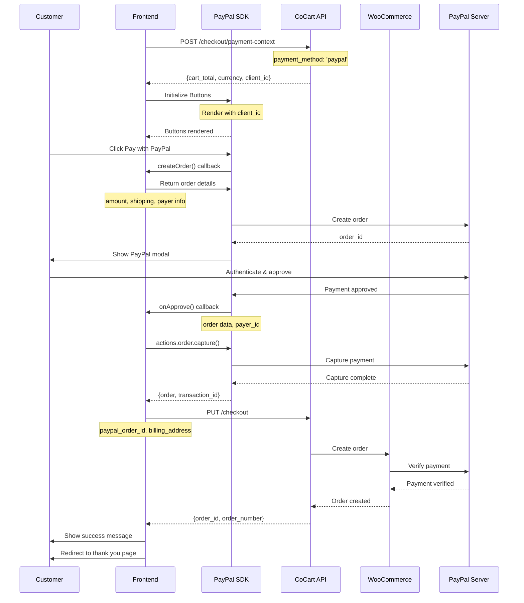

<Warning>
    This tutorial was written by [Claude Code (an AI)](https://claude.com/product/claude-code) and has not yet been reviewed. Follow along with caution. If the tutorial was helpful or a specific part was not clear/correct, please provide feedback at the bottom of the page. Thank you.
</Warning>

<Note>
    This guide covers integrating PayPal with CoCart Preview API. Requires CoCart v4.6+ and a configured PayPal payment gateway.
</Note>

## Overview

PayPal integration with CoCart uses PayPal's JavaScript SDK to create a seamless checkout experience. Customers can pay with their PayPal account, credit cards, or other payment methods supported by PayPal.

## Prerequisites

Before implementing PayPal checkout, ensure you have:

1. PayPal payment gateway configured in WooCommerce
2. PayPal JavaScript SDK loaded in your frontend
3. A valid cart with items added
4. Customer billing address information

## Integration Flow



<Steps>
    <Step title="Initialize PayPal Buttons">
        Set up PayPal SDK with your store's client ID and cart information
    </Step>
    <Step title="Handle Payment Creation">
        Create PayPal order when customer clicks Pay with PayPal
    </Step>
    <Step title="Handle Payment Approval">
        Process the PayPal payment approval and capture transaction details
    </Step>
    <Step title="Complete Checkout">
        Submit checkout with PayPal order ID to CoCart for order creation
    </Step>
</Steps>

## Step 1: Load PayPal SDK

Include the PayPal JavaScript SDK in your page:

```html
<script src="https://www.paypal.com/sdk/js?client-id=YOUR_PAYPAL_CLIENT_ID&currency=USD&components=buttons"></script>
```

Replace `YOUR_PAYPAL_CLIENT_ID` with your actual PayPal client ID from your WooCommerce PayPal settings.

## Step 2: Get Cart Information

Get the cart total and currency for PayPal order creation:

<Tabs>
    <Tab title="JavaScript">
    ```javascript
    async function getCartTotal() {
        const cartKey = localStorage.getItem('cart_key');

        const response = await fetch('https://yoursite.com/wp-json/cocart/preview/checkout', {
            method: 'GET',
            headers: {
                'Cart-Key': cartKey,
                'Content-Type': 'application/json',
            }
        });

        const cartData = await response.json();

        if (!response.ok) {
            throw new Error(cartData.message || 'Failed to get cart data');
        }

        return {
            total: cartData.cart_totals.total,
            currency: cartData.currency || 'USD'
        };
    }
    ```
    </Tab>

    <Tab title="PHP">
    ```php
    function get_cart_total_for_paypal( $cart_key ) {
        $response = wp_remote_get( 'https://yoursite.com/wp-json/cocart/preview/checkout', array(
            'headers' => array(
                'Cart-Key' => $cart_key,
                'Content-Type' => 'application/json',
            ),
            'timeout' => 30,
        ) );

        if ( is_wp_error( $response ) ) {
            throw new Exception( $response->get_error_message() );
        }

        $cart_data = json_decode( wp_remote_retrieve_body( $response ), true );

        if ( wp_remote_retrieve_response_code( $response ) !== 200 ) {
            throw new Exception( $cart_data['message'] ?? 'Failed to get cart data' );
        }

        return array(
            'total' => $cart_data['cart_totals']['total'],
            'currency' => $cart_data['currency'] ?? 'USD'
        );
    }
    ```
    </Tab>
</Tabs>

<Warning>
**Important**: Your PayPal client ID in the JavaScript SDK must exactly match the one configured in your WooCommerce PayPal settings.
</Warning>

## Step 3: HTML Structure

Your checkout form should include containers for PayPal buttons and customer information:

```html
<form id="checkout-form">
    <!-- Customer Information -->
    <div class="billing-section">
        <h3>Billing Information</h3>
        <input type="text" name="billing_first_name" placeholder="First Name" required>
        <input type="text" name="billing_last_name" placeholder="Last Name" required>
        <input type="email" name="billing_email" placeholder="Email" required>
        <input type="tel" name="billing_phone" placeholder="Phone">
        <input type="text" name="billing_address_1" placeholder="Address" required>
        <input type="text" name="billing_city" placeholder="City" required>
        <input type="text" name="billing_state" placeholder="State" required>
        <input type="text" name="billing_postcode" placeholder="ZIP Code" required>
        <select name="billing_country" required>
            <option value="US">United States</option>
            <!-- Add other countries -->
        </select>
    </div>

    <!-- Shipping Information (if different) -->
    <div class="shipping-section" id="shipping-section" style="display: none;">
        <h3>Shipping Information</h3>
        <input type="text" name="shipping_first_name" placeholder="First Name">
        <input type="text" name="shipping_last_name" placeholder="Last Name">
        <!-- Add other shipping fields -->
    </div>

    <label>
        <input type="checkbox" id="ship-to-different-address"> Ship to a different address
    </label>

    <!-- PayPal Button Container -->
    <div class="payment-section">
        <h3>Payment</h3>
        <div id="paypal-button-container">
            <!-- PayPal buttons will be rendered here -->
        </div>
        <div id="paypal-error-message" class="error-message" style="display: none;"></div>
    </div>
</form>
```

## Step 4: Initialize PayPal Buttons

Set up PayPal buttons with your cart information:

```javascript
async function setupPayPalButtons() {
    try {
        // Get cart total for PayPal order
        const cartInfo = await getCartTotal();

        // Get billing address from form
        const getBillingAddress = () => {
            const form = document.getElementById('checkout-form');
            const formData = new FormData(form);

            return {
                first_name: formData.get('billing_first_name'),
                last_name: formData.get('billing_last_name'),
                email: formData.get('billing_email'),
                phone: formData.get('billing_phone'),
                address_1: formData.get('billing_address_1'),
                city: formData.get('billing_city'),
                state: formData.get('billing_state'),
                postcode: formData.get('billing_postcode'),
                country: formData.get('billing_country')
            };
        };

        // Get shipping address if different
        const getShippingAddress = () => {
            const shipToDifferent = document.getElementById('ship-to-different-address').checked;
            if (!shipToDifferent) {
                return getBillingAddress();
            }

            const form = document.getElementById('checkout-form');
            const formData = new FormData(form);

            return {
                first_name: formData.get('shipping_first_name'),
                last_name: formData.get('shipping_last_name'),
                address_1: formData.get('shipping_address_1'),
                city: formData.get('shipping_city'),
                state: formData.get('shipping_state'),
                postcode: formData.get('shipping_postcode'),
                country: formData.get('shipping_country')
            };
        };

        // Initialize PayPal buttons
        paypal.Buttons({
            // Style the buttons
            style: {
                shape: 'rect',
                color: 'gold',
                layout: 'vertical',
                label: 'paypal',
                height: 50
            },

            // Create the PayPal order
            createOrder: function(data, actions) {
                const billingAddress = getBillingAddress();

                // Validate required fields
                if (!billingAddress.first_name || !billingAddress.email) {
                    showError('Please fill in all required billing information.');
                    return Promise.reject(new Error('Missing required fields'));
                }

                return actions.order.create({
                    purchase_units: [{
                        amount: {
                            value: cartInfo.total,
                            currency_code: cartInfo.currency
                        },
                        shipping: {
                            name: {
                                full_name: `${billingAddress.first_name} ${billingAddress.last_name}`
                            },
                            address: {
                                address_line_1: billingAddress.address_1,
                                admin_area_2: billingAddress.city,
                                admin_area_1: billingAddress.state,
                                postal_code: billingAddress.postcode,
                                country_code: billingAddress.country
                            }
                        }
                    }],
                    payer: {
                        name: {
                            given_name: billingAddress.first_name,
                            surname: billingAddress.last_name
                        },
                        email_address: billingAddress.email,
                        phone: {
                            phone_number: {
                                national_number: billingAddress.phone
                            }
                        },
                        address: {
                            address_line_1: billingAddress.address_1,
                            admin_area_2: billingAddress.city,
                            admin_area_1: billingAddress.state,
                            postal_code: billingAddress.postcode,
                            country_code: billingAddress.country
                        }
                    }
                });
            },

            // Handle successful payment
            onApprove: async function(data, actions) {
                try {
                    // Show loading state
                    showLoading('Processing payment...');

                    // Capture the PayPal payment
                    const order = await actions.order.capture();

                    // Process checkout with PayPal data
                    await processPayPalCheckout(
                        getBillingAddress(),
                        getShippingAddress(),
                        order,
                        data
                    );

                } catch (error) {
                    console.error('PayPal approval error:', error);
                    showError('Payment processing failed. Please try again.');
                }
            },

            // Handle payment cancellation
            onCancel: function(data) {
                console.log('PayPal payment cancelled:', data);
                showError('Payment was cancelled. Please try again.');
            },

            // Handle payment errors
            onError: function(error) {
                console.error('PayPal error:', error);
                showError('Payment failed. Please try again or use a different payment method.');
            }

        }).render('#paypal-button-container');

        console.log('PayPal buttons initialized successfully');

    } catch (error) {
        console.error('PayPal setup error:', error);
        showError('Payment system unavailable. Please try again later.');
    }
}
```

## Step 5: Process Checkout with PayPal Data

Submit the checkout with PayPal transaction information:

```javascript
async function processPayPalCheckout(billingAddress, shippingAddress, paypalOrder, paypalData) {
    const cartKey = localStorage.getItem('cart_key');

    // Extract transaction details
    const capture = paypalOrder.purchase_units[0].payments.captures[0];

    const checkoutData = {
        billing_address: billingAddress,
        shipping_address: shippingAddress,
        payment_method: 'paypal',
        payment_method_data: {
            paypal_order_id: paypalOrder.id,
            paypal_payer_id: paypalData.payerID,
            transaction_id: capture.id,
            payer_email: paypalOrder.payer.email_address,
            payment_status: paypalOrder.status,
            gross_amount: capture.amount.value,
            currency: capture.amount.currency_code,
            payment_fee: capture.seller_receivable_breakdown?.paypal_fee?.value || '0.00'
        }
    };

    const response = await fetch('https://yoursite.com/wp-json/cocart/preview/checkout', {
        method: 'PUT',
        headers: {
            'Cart-Key': cartKey,
            'Content-Type': 'application/json',
        },
        body: JSON.stringify(checkoutData)
    });

    const result = await response.json();

    if (!response.ok) {
        throw new Error(result.message || `HTTP ${response.status}`);
    }

    // Handle successful checkout
    if (result.order_id) {
        showSuccess(`Order #${result.order_number} completed successfully!`);

        // Clear cart
        localStorage.removeItem('cart_key');

        // Redirect to thank you page
        if (result.payment_result?.redirect_url) {
            setTimeout(() => {
                window.location.href = result.payment_result.redirect_url;
            }, 2000);
        }
    }

    return result;
}
```

## Complete Integration Example

Here's a complete working example with form validation:

```javascript
class PayPalCheckout {
    constructor() {
        this.context = null;
        this.formValid = false;
    }

    async initialize() {
        try {
            // Setup form validation
            this.setupFormValidation();

            // Create payment context
            this.context = await this.createPaymentContext();

            // Initialize PayPal buttons
            await this.setupPayPalButtons();

            // Setup shipping toggle
            this.setupShippingToggle();

            console.log('PayPal checkout initialized successfully');
        } catch (error) {
            console.error('PayPal initialization error:', error);
            this.showError('Payment system unavailable. Please try again later.');
        }
    }

    async createPaymentContext() {
        const cartKey = localStorage.getItem('cart_key');

        const response = await fetch('/wp-json/cocart/preview/checkout/payment-context', {
            method: 'POST',
            headers: {
                'Cart-Key': cartKey,
                'Content-Type': 'application/json',
            },
            body: JSON.stringify({ payment_method: 'paypal' })
        });

        const context = await response.json();

        if (!response.ok) {
            throw new Error(context.message || 'Failed to create payment context');
        }

        return context;
    }

    setupFormValidation() {
        const form = document.getElementById('checkout-form');
        const requiredFields = form.querySelectorAll('input[required]');

        const validateForm = () => {
            let isValid = true;

            requiredFields.forEach(field => {
                if (!field.value.trim()) {
                    isValid = false;
                    field.classList.add('error');
                } else {
                    field.classList.remove('error');
                }
            });

            // Email validation
            const emailField = form.querySelector('input[type="email"]');
            if (emailField.value && !this.isValidEmail(emailField.value)) {
                isValid = false;
                emailField.classList.add('error');
            }

            this.formValid = isValid;
            this.updatePayPalButtonsState();

            return isValid;
        };

        // Add event listeners
        requiredFields.forEach(field => {
            field.addEventListener('blur', validateForm);
            field.addEventListener('input', validateForm);
        });

        // Initial validation
        validateForm();
    }

    updatePayPalButtonsState() {
        const container = document.getElementById('paypal-button-container');
        if (this.formValid) {
            container.style.opacity = '1';
            container.style.pointerEvents = 'auto';
        } else {
            container.style.opacity = '0.5';
            container.style.pointerEvents = 'none';
        }
    }

    setupShippingToggle() {
        const checkbox = document.getElementById('ship-to-different-address');
        const shippingSection = document.getElementById('shipping-section');

        checkbox.addEventListener('change', () => {
            if (checkbox.checked) {
                shippingSection.style.display = 'block';
                // Make shipping fields required
                shippingSection.querySelectorAll('input').forEach(input => {
                    input.required = true;
                });
            } else {
                shippingSection.style.display = 'none';
                // Remove required attribute
                shippingSection.querySelectorAll('input').forEach(input => {
                    input.required = false;
                });
            }
        });
    }

    async setupPayPalButtons() {
        return new Promise((resolve, reject) => {
            paypal.Buttons({
                style: {
                    shape: 'rect',
                    color: 'gold',
                    layout: 'vertical',
                    label: 'paypal',
                    height: 50
                },

                createOrder: (data, actions) => {
                    if (!this.formValid) {
                        this.showError('Please fill in all required fields before proceeding.');
                        return Promise.reject(new Error('Form validation failed'));
                    }

                    const billingAddress = this.getBillingAddress();

                    return actions.order.create({
                        purchase_units: [{
                            amount: {
                                value: this.context.cart_total,
                                currency_code: this.context.currency
                            },
                            shipping: this.createShippingInfo(billingAddress)
                        }],
                        payer: this.createPayerInfo(billingAddress)
                    });
                },

                onApprove: async (data, actions) => {
                    try {
                        this.showLoading('Processing payment...');

                        const order = await actions.order.capture();

                        await this.processCheckout(
                            this.getBillingAddress(),
                            this.getShippingAddress(),
                            order,
                            data
                        );

                    } catch (error) {
                        console.error('PayPal approval error:', error);
                        this.showError('Payment processing failed. Please try again.');
                    }
                },

                onCancel: (data) => {
                    console.log('PayPal payment cancelled:', data);
                    this.showError('Payment was cancelled. You can try again anytime.');
                },

                onError: (error) => {
                    console.error('PayPal error:', error);
                    this.showError('Payment failed. Please try again or contact support.');
                }

            }).render('#paypal-button-container').then(() => {
                resolve();
            }).catch(reject);
        });
    }

    getBillingAddress() {
        const form = document.getElementById('checkout-form');
        const formData = new FormData(form);

        return {
            first_name: formData.get('billing_first_name'),
            last_name: formData.get('billing_last_name'),
            email: formData.get('billing_email'),
            phone: formData.get('billing_phone'),
            address_1: formData.get('billing_address_1'),
            city: formData.get('billing_city'),
            state: formData.get('billing_state'),
            postcode: formData.get('billing_postcode'),
            country: formData.get('billing_country')
        };
    }

    getShippingAddress() {
        const shipToDifferent = document.getElementById('ship-to-different-address').checked;
        if (!shipToDifferent) {
            return this.getBillingAddress();
        }

        const form = document.getElementById('checkout-form');
        const formData = new FormData(form);

        return {
            first_name: formData.get('shipping_first_name'),
            last_name: formData.get('shipping_last_name'),
            address_1: formData.get('shipping_address_1'),
            city: formData.get('shipping_city'),
            state: formData.get('shipping_state'),
            postcode: formData.get('shipping_postcode'),
            country: formData.get('shipping_country')
        };
    }

    createShippingInfo(address) {
        return {
            name: {
                full_name: `${address.first_name} ${address.last_name}`
            },
            address: {
                address_line_1: address.address_1,
                admin_area_2: address.city,
                admin_area_1: address.state,
                postal_code: address.postcode,
                country_code: address.country
            }
        };
    }

    createPayerInfo(address) {
        return {
            name: {
                given_name: address.first_name,
                surname: address.last_name
            },
            email_address: address.email,
            phone: address.phone ? {
                phone_number: {
                    national_number: address.phone
                }
            } : undefined,
            address: {
                address_line_1: address.address_1,
                admin_area_2: address.city,
                admin_area_1: address.state,
                postal_code: address.postcode,
                country_code: address.country
            }
        };
    }

    async processCheckout(billingAddress, shippingAddress, paypalOrder, paypalData) {
        const cartKey = localStorage.getItem('cart_key');
        const capture = paypalOrder.purchase_units[0].payments.captures[0];

        const response = await fetch('/wp-json/cocart/preview/checkout', {
            method: 'PUT',
            headers: {
                'Cart-Key': cartKey,
                'Content-Type': 'application/json',
            },
            body: JSON.stringify({
                billing_address: billingAddress,
                shipping_address: shippingAddress,
                payment_method: 'paypal',
                payment_data: {
                    paypal_order_id: paypalOrder.id,
                    paypal_payer_id: paypalData.payerID,
                    transaction_id: capture.id,
                    payer_email: paypalOrder.payer.email_address,
                    payment_status: paypalOrder.status,
                    gross_amount: capture.amount.value,
                    currency: capture.amount.currency_code
                }
            })
        });

        const result = await response.json();

        if (!response.ok) {
            throw new Error(result.message || `HTTP ${response.status}`);
        }

        this.handleCheckoutSuccess(result);
        return result;
    }

    handleCheckoutSuccess(result) {
        this.showSuccess(`Order #${result.order_number} completed successfully!`);
        localStorage.removeItem('cart_key');

        if (result.payment_result?.redirect_url) {
            setTimeout(() => {
                window.location.href = result.payment_result.redirect_url;
            }, 2000);
        }
    }

    isValidEmail(email) {
        const emailRegex = /^[^\s@]+@[^\s@]+\.[^\s@]+$/;
        return emailRegex.test(email);
    }

    showError(message) {
        const errorElement = document.getElementById('paypal-error-message');
        errorElement.textContent = message;
        errorElement.style.display = 'block';
        errorElement.className = 'error-message';
    }

    showSuccess(message) {
        const errorElement = document.getElementById('paypal-error-message');
        errorElement.textContent = message;
        errorElement.style.display = 'block';
        errorElement.className = 'success-message';
    }

    showLoading(message) {
        const errorElement = document.getElementById('paypal-error-message');
        errorElement.textContent = message;
        errorElement.style.display = 'block';
        errorElement.className = 'loading-message';
    }
}

// Initialize when DOM is loaded
document.addEventListener('DOMContentLoaded', async () => {
    const checkout = new PayPalCheckout();
    await checkout.initialize();
});
```

## Error Handling

Handle common PayPal errors:

```javascript
function handlePayPalError(error) {
    let message = 'Payment failed. Please try again.';

    // PayPal specific error codes
    if (error.details) {
        const detail = error.details[0];

        switch (detail.issue) {
            case 'INSTRUMENT_DECLINED':
                message = 'Your payment method was declined. Please try a different payment method.';
                break;
            case 'PAYER_ACCOUNT_RESTRICTED':
                message = 'Your PayPal account has restrictions. Please contact PayPal support.';
                break;
            case 'PAYER_CANNOT_PAY':
                message = 'Unable to process payment with this PayPal account. Please try a different payment method.';
                break;
            case 'PAYEE_ACCOUNT_RESTRICTED':
                message = 'Unable to process payment at this time. Please try again later.';
                break;
            default:
                message = detail.description || message;
        }
    }

    document.getElementById('paypal-error-message').textContent = message;
    document.getElementById('paypal-error-message').style.display = 'block';
}
```

## Testing

For development and testing:

1. Use PayPal Sandbox accounts
2. Test with different PayPal account types (personal, business)
3. Test payment cancellations
4. Test network failures during payment

## Troubleshooting

### Common Issues

<AccordionGroup>
    <Accordion title="PayPal Buttons Not Displaying">
        **Problem**: PayPal buttons don't appear on the page.

        **Solution**: Check these common issues:
        ```javascript
        // Verify PayPal SDK is loaded
        if (typeof paypal === 'undefined') {
            console.error('PayPal SDK not loaded');
            // Check the script tag is present and loads successfully
        }

        // Ensure container exists before rendering
        const container = document.getElementById('paypal-button-container');
        if (!container) {
            console.error('PayPal button container not found');
        }

        // Check for initialization errors
        paypal.Buttons({
            // ... your configuration
        }).render('#paypal-button-container').catch(error => {
            console.error('PayPal button render error:', error);
        });
        ```
        - Verify the PayPal SDK script tag is present and loading
        - Check client ID is correct and matches WooCommerce settings
        - Ensure container element exists in DOM
        - Look for JavaScript errors in browser console
        - Verify no CSS is hiding the container
    </Accordion>

    <Accordion title="Wrong Client ID or Currency Error">
        **Problem**: "Invalid client ID" or currency mismatch errors.

        **Solution**: Ensure SDK configuration matches your store:
        ```html
        <!-- Client ID must match WooCommerce PayPal settings -->
        <script src="https://www.paypal.com/sdk/js?client-id=YOUR_CLIENT_ID&currency=USD"></script>
        ```
        - Get client ID from WooCommerce → Settings → Payments → PayPal
        - Verify currency matches your store's currency
        - Use sandbox client ID for testing, live client ID for production
        - Check that your PayPal account supports the currency
    </Accordion>

    <Accordion title="'createOrder' Function Errors">
        **Problem**: Errors when creating PayPal order.

        **Solution**: Verify order data structure:
        ```javascript
        createOrder: function(data, actions) {
            // Validate cart total exists
            if (!cartInfo.total || cartInfo.total <= 0) {
                console.error('Invalid cart total:', cartInfo.total);
                return Promise.reject(new Error('Invalid cart total'));
            }

            return actions.order.create({
                purchase_units: [{
                    amount: {
                        value: cartInfo.total, // Must be string or number
                        currency_code: cartInfo.currency // Must match SDK currency
                    }
                }]
            });
        }
        ```
        - Ensure amount.value is a valid number or string
        - Verify currency_code matches SDK initialization
        - Check that cart total is greater than zero
        - Validate all required billing/shipping fields are provided
    </Accordion>

    <Accordion title="Payment Approved But Order Not Created">
        **Problem**: PayPal payment succeeds but WooCommerce order fails to create.

        **Solution**: Debug the onApprove callback:
        ```javascript
        onApprove: async function(data, actions) {
            try {
                console.log('PayPal approval data:', data);

                const order = await actions.order.capture();
                console.log('PayPal order captured:', order);

                // Verify order structure
                if (!order.purchase_units || !order.purchase_units[0].payments.captures[0]) {
                    throw new Error('Invalid PayPal order structure');
                }

                // Submit to CoCart
                const checkoutResponse = await processPayPalCheckout(
                    billingAddress,
                    shippingAddress,
                    order,
                    data
                );

                console.log('Checkout response:', checkoutResponse);

            } catch (error) {
                console.error('onApprove error:', error);
                // Check if error is from PayPal capture or CoCart checkout
            }
        }
        ```
        - Check browser console for error details
        - Verify billing address is complete and valid
        - Check PHP error logs for server-side issues
        - Ensure payment_method is set to 'paypal'
        - Verify WooCommerce PayPal gateway is active
    </Accordion>

    <Accordion title="Buttons Disabled or Grayed Out">
        **Problem**: PayPal buttons appear but are disabled.

        **Solution**: Common causes:
        ```javascript
        // 1. Form validation preventing button enable
        createOrder: function(data, actions) {
            // Check if form is valid
            if (!validateForm()) {
                // Show error message to user
                showError('Please fill in all required fields');
                return Promise.reject(new Error('Form validation failed'));
            }

            return actions.order.create({...});
        }

        // 2. CSS preventing interaction
        #paypal-button-container {
            pointer-events: auto; /* Ensure not disabled */
            opacity: 1;
        }
        ```
        - Verify form validation isn't blocking buttons
        - Check for `pointer-events: none` CSS
        - Ensure buttons finished rendering completely
        - Look for overlay elements covering buttons
    </Accordion>

    <Accordion title="'INSTRUMENT_DECLINED' Error">
        **Problem**: Customer's payment method is declined by PayPal.

        **Solution**: Handle gracefully:
        ```javascript
        onError: function(error) {
            console.error('PayPal error:', error);

            let message = 'Payment failed. Please try again.';

            if (error.message && error.message.includes('INSTRUMENT_DECLINED')) {
                message = 'Your payment method was declined. Please try a different payment method or contact PayPal support.';
            }

            showError(message);
        }
        ```
        Common reasons:
        - Insufficient funds in PayPal account
        - Payment method (bank/card) linked to PayPal is invalid
        - PayPal account restrictions or limitations
        - International transaction not supported
    </Accordion>

    <Accordion title="Payment Cancellation Issues">
        **Problem**: onCancel not triggered or not handled properly.

        **Solution**: Implement comprehensive cancellation handling:
        ```javascript
        onCancel: function(data) {
            console.log('PayPal payment cancelled:', data);

            // Clear any loading states
            hideLoading();

            // Show user-friendly message
            showMessage('Payment was cancelled. You can try again anytime.');

            // Re-enable form or payment buttons
            enablePaymentForm();

            // Optional: Track cancellation for analytics
            trackEvent('paypal_payment_cancelled', data);
        }
        ```
        - Test cancellation flow thoroughly
        - Ensure UI resets to allow retry
        - Don't treat cancellation as an error
        - Provide clear next steps for customer
    </Accordion>

    <Accordion title="Sandbox vs Production Mode Issues">
        **Problem**: Works in sandbox but fails in production.

        **Solution**: Verify production configuration:
        ```javascript
        // Ensure using correct credentials for environment
        const clientId = isProduction
            ? 'YOUR_LIVE_CLIENT_ID'   // Live from PayPal dashboard
            : 'YOUR_SANDBOX_CLIENT_ID'; // Sandbox from developer dashboard

        // SDK URL for production (no -sandbox)
        const sdkUrl = `https://www.paypal.com/sdk/js?client-id=${clientId}&currency=USD`;
        ```
        Checklist for going live:
        - Switch to live client ID in WooCommerce settings
        - Update SDK script to use live client ID
        - Verify PayPal account is verified and approved for production
        - Test with real PayPal account (small amount)
        - Configure production webhooks
        - Enable live payment processing in WooCommerce
    </Accordion>

    <Accordion title="Webhook Events Not Received">
        **Problem**: Not receiving PayPal webhook notifications.

        **Solution**: Configure webhooks properly:
        1. Go to PayPal Developer Dashboard → My Apps & Credentials
        2. Select your app
        3. Scroll to Webhooks section
        4. Add webhook URL: `https://yoursite.com/wc-api/wc_gateway_paypal_express_helper/`
        5. Subscribe to events:
           - Payment sale completed
           - Payment sale refunded
           - Payment capture completed
        6. Test webhook delivery
        7. Check webhook signature verification in WooCommerce logs
    </Accordion>

    <Accordion title="Amount Mismatch Errors">
        **Problem**: "Amount mismatch" errors during checkout.

        **Solution**: Ensure consistency:
        ```javascript
        // PayPal amount format
        const paypalAmount = parseFloat(cartTotal).toFixed(2); // "10.00"

        // In createOrder
        amount: {
            value: paypalAmount, // String with 2 decimals
            currency_code: 'USD'
        }

        // In CoCart checkout
        payment_data: {
            gross_amount: paypalAmount, // Must match PayPal order
            currency: 'USD'
        }
        ```
        - Use consistent decimal formatting (2 decimal places)
        - Match currency codes everywhere
        - Don't modify cart during PayPal flow
        - Verify cart hasn't changed between order creation and checkout
    </Accordion>
</AccordionGroup>

### Debug Mode

Enable detailed logging for troubleshooting:

```javascript
// Add detailed PayPal logging
const DEBUG = true; // Set to false in production

if (DEBUG) {
    paypal.Buttons({
        onInit: function(data, actions) {
            console.log('[PayPal] Buttons initialized', data);
        },
        onClick: function(data, actions) {
            console.log('[PayPal] Button clicked', data);
        },
        createOrder: function(data, actions) {
            console.log('[PayPal] Creating order');
            return actions.order.create({...}).then(orderId => {
                console.log('[PayPal] Order created:', orderId);
                return orderId;
            });
        },
        onApprove: function(data, actions) {
            console.log('[PayPal] Payment approved:', data);
            return actions.order.capture().then(details => {
                console.log('[PayPal] Payment captured:', details);
                return details;
            });
        },
        onCancel: function(data) {
            console.log('[PayPal] Payment cancelled:', data);
        },
        onError: function(error) {
            console.error('[PayPal] Error:', error);
        }
    }).render('#paypal-button-container');
}
```

### Getting Help

If issues persist:

1. **PayPal Developer Forums**: Visit [PayPal Developer Community](https://www.paypal-community.com/t5/Merchant-Services-Development/ct-p/devtools)
2. **PayPal Documentation**: Check [PayPal JavaScript SDK documentation](https://developer.paypal.com/sdk/js/)
3. **WooCommerce Logs**: Review logs at WooCommerce → Status → Logs
4. **Browser Console**: Always check for JavaScript errors
5. **Network Tab**: Monitor API calls in browser DevTools

## Best Practices

<CardGroup cols={2}>
    <Card title="User Experience" icon="user">
    - Validate forms before enabling PayPal buttons
    - Show clear loading states during processing
    - Handle payment cancellations gracefully
    - Provide clear error messages
    </Card>

    <Card title="Security" icon="shield-check">
    - Use HTTPS for all requests
    - Validate data server-side
    - Never expose sensitive keys client-side
    - Handle webhook validations properly
    </Card>

    <Card title="Performance" icon="gauge-high">
    - Load PayPal SDK asynchronously
    - Cache payment contexts when possible
    - Minimize API calls
    - Handle timeouts appropriately
    </Card>

    <Card title="Accessibility" icon="universal-access">
    - Ensure buttons are keyboard accessible
    - Provide alternative payment methods
    - Use proper ARIA labels
    - Test with screen readers
    </Card>
</CardGroup>

<Note>
    Always test your PayPal integration thoroughly using PayPal's sandbox environment before going live. Configure webhook endpoints to handle payment notifications and updates.
</Note>