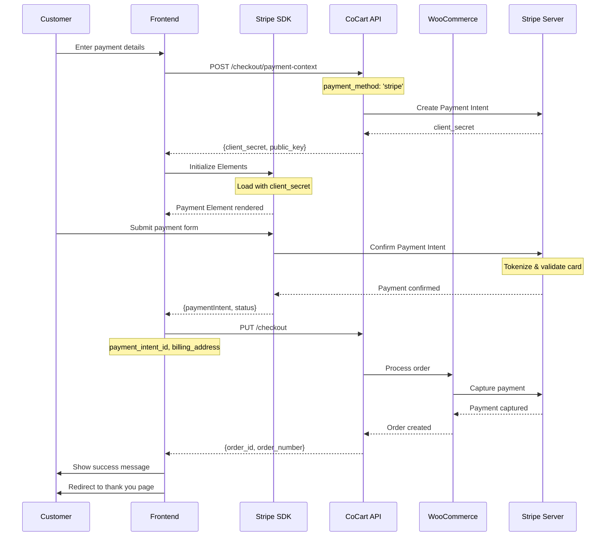

<Warning>
    This tutorial was written by [Claude Code (an AI)](https://claude.com/product/claude-code) and has not yet been reviewed. Follow along with caution. If the tutorial was helpful or a specific part was not clear/correct, please provide feedback at the bottom of the page. Thank you.
</Warning>

<Note>
    This guide covers integrating Stripe with CoCart Preview API. Requires CoCart v4.6+ and a configured Stripe payment gateway.
</Note>

<Warning>
**Plugin Compatibility**: This tutorial covers the **WooCommerce Stripe Payment Gateway** plugin, not WooCommerce Payments (WCPay).

- **WooCommerce Stripe Gateway** (`payment_method: 'stripe'`) - Full API access, designed for headless checkout ✅
- **WooCommerce Payments** (`payment_method: 'woocommerce_payments'`) - Managed solution for traditional WooCommerce checkout only ❌

For headless/API-based checkout with CoCart, use the standard WooCommerce Stripe Gateway plugin.
</Warning>

## Overview

Stripe integration with CoCart follows a secure client-side payment flow using Stripe Elements and Payment Intents. This ensures sensitive payment data never touches your server while providing a seamless checkout experience.

## Prerequisites

Before implementing Stripe checkout, ensure you have:

1. Stripe payment gateway configured in WooCommerce
2. Stripe JavaScript SDK loaded in your frontend
3. A valid cart with items added
4. Customer billing address information

## Integration Flow



<Steps>
    <Step title="Initialize Stripe Elements">
        Set up Stripe SDK with your store's publishable key and create payment form
    </Step>
    <Step title="Collect Payment Details">
        Let customers securely enter their payment information using Stripe Elements
    </Step>
    <Step title="Create Payment Method">
        Generate a payment method using Stripe's client-side API
    </Step>
    <Step title="Complete Checkout">
        Submit the checkout with payment method reference to CoCart
    </Step>
</Steps>

## Step 1: Initialize Stripe Elements

First, set up Stripe with your store's publishable key and create the payment form:

<Tabs>
    <Tab title="JavaScript">
    ```javascript
    // Initialize Stripe with your store's publishable key
    const stripe = Stripe('pk_live_your_stripe_publishable_key'); // Must match WooCommerce settings
    const elements = stripe.elements();

    // Create payment element with styling
    const cardElement = elements.create('card', {
        style: {
            base: {
                fontSize: '16px',
                color: '#424770',
                '::placeholder': {
                    color: '#aab7c4',
                },
            },
            invalid: {
                color: '#9e2146',
            },
        },
    });

    // Mount the card element to your form
    cardElement.mount('#card-element');

    // Handle real-time validation errors from the card Element
    cardElement.on('change', ({error}) => {
        const displayError = document.getElementById('card-errors');
        if (error) {
            displayError.textContent = error.message;
        } else {
            displayError.textContent = '';
        }
    });
    ```
    </Tab>

    <Tab title="HTML">
    ```html
    <!-- Load Stripe.js -->
    <script src="https://js.stripe.com/v3/"></script>

    <!-- Payment form -->
    <form id="payment-form">
        <div id="card-element">
            <!-- Elements will create input elements here -->
        </div>

        <!-- Display form errors -->
        <div id="card-errors" role="alert"></div>

        <button type="submit" id="submit-button">
            Pay Now
        </button>
    </form>
    ```
    </Tab>
</Tabs>

<Warning>
**Important**: The publishable key in your JavaScript code must exactly match the one configured in your WooCommerce Stripe settings.
</Warning>

## Step 2: Create Payment Method

When the customer submits the form, create a payment method using Stripe:

```javascript
async function handlePaymentSubmission(event) {
    event.preventDefault();

    const form = event.target;
    const submitButton = form.querySelector('#submit-button');

    // Disable submit button
    submitButton.disabled = true;
    submitButton.textContent = 'Processing...';

    try {
        // Create payment method
        const {paymentMethod, error} = await stripe.createPaymentMethod({
            type: 'card',
            card: cardElement,
            billing_details: {
                name: form.billing_first_name.value + ' ' + form.billing_last_name.value,
                email: form.billing_email.value,
                address: {
                    line1: form.billing_address_1.value,
                    city: form.billing_city.value,
                    state: form.billing_state.value,
                    postal_code: form.billing_postcode.value,
                    country: form.billing_country.value,
                }
            },
        });

        if (error) {
            throw new Error(error.message);
        }

        // Payment method created successfully
        console.log('Payment method created:', paymentMethod.id);

        // Proceed to checkout
        await processCheckoutWithStripe(paymentMethod);

    } catch (error) {
        console.error('Payment method creation failed:', error);
        document.getElementById('card-errors').textContent = error.message;

        // Re-enable submit button
        submitButton.disabled = false;
        submitButton.textContent = 'Pay Now';
    }
}

// Attach event listener to form
document.getElementById('payment-form').addEventListener('submit', handlePaymentSubmission);
```

## Step 3: Complete Checkout

Process the checkout with the payment method reference:

```javascript
async function processCheckoutWithStripe(paymentMethod) {
    const cartKey = localStorage.getItem('cart_key');
    const form = document.getElementById('payment-form');

    try {
        // Collect billing information from form
        const billingData = {
            first_name: form.billing_first_name.value,
            last_name: form.billing_last_name.value,
            email: form.billing_email.value,
            phone: form.billing_phone?.value || '',
            address_1: form.billing_address_1.value,
            city: form.billing_city.value,
            state: form.billing_state.value,
            postcode: form.billing_postcode.value,
            country: form.billing_country.value
        };

        // Submit checkout to CoCart
        const response = await fetch('https://yoursite.com/wp-json/cocart/preview/checkout', {
            method: 'PUT',
            headers: {
                'Cart-Key': cartKey,
                'Content-Type': 'application/json',
            },
            body: JSON.stringify({
                billing_address: billingData,
                payment_method: 'stripe',
                payment_method_data: {
                    payment_method: paymentMethod.id // Pass payment method reference
                }
            })
        });

        const result = await response.json();

        if (!response.ok) {
            throw new Error(result.message || 'Checkout failed');
        }

        // Handle successful order
        if (result.order_id) {
            console.log('Order created:', result.order_id);

            // Clear cart
            localStorage.removeItem('cart_key');

            // Redirect to success page or show confirmation
            if (result.payment_result?.redirect_url) {
                window.location.href = result.payment_result.redirect_url;
            } else {
                showSuccessMessage(`Order #${result.order_number} completed successfully!`);
            }
        }

    } catch (error) {
        console.error('Checkout error:', error);
        document.getElementById('card-errors').textContent = error.message;

        // Re-enable form
        const submitButton = document.getElementById('submit-button');
        submitButton.disabled = false;
        submitButton.textContent = 'Pay Now';
    }
}
```

## Complete Example

Here's a complete working example that puts it all together:

```javascript
async function handleCheckoutSubmission() {
    const form = document.getElementById('checkout-form');
    const submitButton = document.getElementById('submit-button');
    const buttonText = document.getElementById('button-text');
    const buttonSpinner = document.getElementById('button-spinner');

    form.addEventListener('submit', async (event) => {
        event.preventDefault();

        // Disable submit button
        submitButton.disabled = true;
        buttonText.textContent = 'Processing...';
        buttonSpinner.style.display = 'inline-block';

        try {
            // Get form data
            const formData = new FormData(form);
            const billingAddress = {
                first_name: formData.get('billing_first_name'),
                last_name: formData.get('billing_last_name'),
                email: formData.get('billing_email'),
                phone: formData.get('billing_phone'),
                address_1: formData.get('billing_address_1'),
                city: formData.get('billing_city'),
                state: formData.get('billing_state'),
                postcode: formData.get('billing_postcode'),
                country: formData.get('billing_country')
            };

            // Confirm payment with Stripe
            const { error, paymentIntent } = await window.stripeInstance.confirmPayment({
                elements: window.stripeElements,
                redirect: 'if_required',
                confirmParams: {
                    return_url: window.location.href,
                    payment_method_data: {
                        billing_details: {
                            name: `${billingAddress.first_name} ${billingAddress.last_name}`,
                            email: billingAddress.email,
                            phone: billingAddress.phone,
                            address: {
                                line1: billingAddress.address_1,
                                city: billingAddress.city,
                                state: billingAddress.state,
                                postal_code: billingAddress.postcode,
                                country: billingAddress.country
                            }
                        }
                    }
                }
            });

            if (error) {
                showStripeError(error);
                return;
            }

            // Payment successful, process checkout
            if (paymentIntent.status === 'succeeded') {
                await processCheckoutWithStripe(billingAddress, paymentIntent);
            } else {
                throw new Error(`Unexpected payment status: ${paymentIntent.status}`);
            }

        } catch (error) {
            console.error('Checkout error:', error);
            showError(error.message || 'Checkout failed. Please try again.');
        } finally {
            // Re-enable submit button
            submitButton.disabled = false;
            buttonText.textContent = 'Complete Order';
            buttonSpinner.style.display = 'none';
        }
    });
}
```

## Step 5: Process Checkout with Payment Data

Submit the checkout with Stripe payment information:

```javascript
async function processCheckoutWithStripe(billingAddress, paymentIntent) {
    const cartKey = localStorage.getItem('cart_key');

    const checkoutData = {
        billing_address: billingAddress,
        payment_method: 'stripe',
        payment_data: {
            payment_intent_id: paymentIntent.id,
            payment_method_id: paymentIntent.payment_method,
            client_secret: window.paymentContext.client_secret,
            receipt_email: billingAddress.email
        }
    };

    const response = await fetch('https://yoursite.com/wp-json/cocart/preview/checkout', {
        method: 'PUT',
        headers: {
            'Cart-Key': cartKey,
            'Content-Type': 'application/json',
        },
        body: JSON.stringify(checkoutData)
    });

    const result = await response.json();

    if (!response.ok) {
        throw new Error(result.message || `HTTP ${response.status}`);
    }

    // Handle successful checkout
    if (result.order_id) {
        showSuccessMessage(`Order #${result.order_number} completed successfully!`);

        // Clear cart
        localStorage.removeItem('cart_key');

        // Redirect to thank you page
        if (result.payment_result?.redirect_url) {
            setTimeout(() => {
                window.location.href = result.payment_result.redirect_url;
            }, 2000);
        }
    }

    return result;
}
```

## Complete Integration Example

Here's a complete working example:

```javascript
class StripeCheckout {
    constructor() {
        this.stripe = null;
        this.elements = null;
        this.context = null;
    }

    async initialize() {
        try {
            // Setup Stripe Elements
            await this.setupElements();

            // Handle form submission
            this.handleFormSubmission();

            console.log('Stripe checkout initialized successfully');
        } catch (error) {
            console.error('Stripe initialization error:', error);
            this.showError('Payment system unavailable. Please try again later.');
        }
    }

    async setupElements() {
        // Create payment context
        this.context = await this.createPaymentContext();

        // Initialize Stripe
        this.stripe = Stripe(this.context.public_key);

        // Create Elements
        this.elements = this.stripe.elements({
            clientSecret: this.context.client_secret,
            appearance: {
                theme: 'stripe',
                variables: {
                    colorPrimary: '#0570de',
                    borderRadius: '8px'
                }
            }
        });

        // Create and mount payment element
        const paymentElement = this.elements.create('payment');
        paymentElement.mount('#stripe-payment-element');

        // Handle real-time validation errors
        paymentElement.on('change', ({ error }) => {
            const errorElement = document.getElementById('stripe-error-message');
            if (error) {
                errorElement.textContent = error.message;
                errorElement.style.display = 'block';
            } else {
                errorElement.style.display = 'none';
            }
        });
    }

    async createPaymentContext() {
        const cartKey = localStorage.getItem('cart_key');

        const response = await fetch('/wp-json/cocart/preview/checkout/payment-context', {
            method: 'POST',
            headers: {
                'Cart-Key': cartKey,
                'Content-Type': 'application/json',
            },
            body: JSON.stringify({ payment_method: 'stripe' })
        });

        const context = await response.json();

        if (!response.ok) {
            throw new Error(context.message || 'Failed to create payment context');
        }

        return context;
    }

    handleFormSubmission() {
        const form = document.getElementById('checkout-form');

        form.addEventListener('submit', async (event) => {
            event.preventDefault();

            const submitButton = form.querySelector('[type="submit"]');
            const originalText = submitButton.textContent;

            try {
                submitButton.disabled = true;
                submitButton.textContent = 'Processing...';

                // Get billing address
                const billingAddress = this.getBillingAddressFromForm(form);

                // Confirm payment
                const { error, paymentIntent } = await this.stripe.confirmPayment({
                    elements: this.elements,
                    redirect: 'if_required',
                    confirmParams: {
                        return_url: window.location.href,
                        payment_method_data: {
                            billing_details: this.formatBillingDetailsForStripe(billingAddress)
                        }
                    }
                });

                if (error) {
                    this.showError(`Payment failed: ${error.message}`);
                    return;
                }

                if (paymentIntent.status === 'succeeded') {
                    await this.processCheckout(billingAddress, paymentIntent);
                }

            } catch (error) {
                console.error('Checkout error:', error);
                this.showError('Checkout failed. Please try again.');
            } finally {
                submitButton.disabled = false;
                submitButton.textContent = originalText;
            }
        });
    }

    getBillingAddressFromForm(form) {
        const formData = new FormData(form);
        return {
            first_name: formData.get('billing_first_name'),
            last_name: formData.get('billing_last_name'),
            email: formData.get('billing_email'),
            phone: formData.get('billing_phone'),
            address_1: formData.get('billing_address_1'),
            city: formData.get('billing_city'),
            state: formData.get('billing_state'),
            postcode: formData.get('billing_postcode'),
            country: formData.get('billing_country')
        };
    }

    formatBillingDetailsForStripe(billingAddress) {
        return {
            name: `${billingAddress.first_name} ${billingAddress.last_name}`,
            email: billingAddress.email,
            phone: billingAddress.phone,
            address: {
                line1: billingAddress.address_1,
                city: billingAddress.city,
                state: billingAddress.state,
                postal_code: billingAddress.postcode,
                country: billingAddress.country
            }
        };
    }

    async processCheckout(billingAddress, paymentIntent) {
        const cartKey = localStorage.getItem('cart_key');

        const response = await fetch('/wp-json/cocart/preview/checkout', {
            method: 'PUT',
            headers: {
                'Cart-Key': cartKey,
                'Content-Type': 'application/json',
            },
            body: JSON.stringify({
                billing_address: billingAddress,
                payment_method: 'stripe',
                payment_data: {
                    payment_intent_id: paymentIntent.id,
                    payment_method_id: paymentIntent.payment_method,
                    client_secret: this.context.client_secret
                }
            })
        });

        const result = await response.json();

        if (!response.ok) {
            throw new Error(result.message || `HTTP ${response.status}`);
        }

        // Handle success
        this.handleCheckoutSuccess(result);

        return result;
    }

    handleCheckoutSuccess(result) {
        this.showSuccess(`Order #${result.order_number} completed successfully!`);

        // Clear cart
        localStorage.removeItem('cart_key');

        // Redirect after delay
        if (result.payment_result?.redirect_url) {
            setTimeout(() => {
                window.location.href = result.payment_result.redirect_url;
            }, 2000);
        }
    }

    showError(message) {
        const errorElement = document.getElementById('stripe-error-message');
        errorElement.textContent = message;
        errorElement.style.display = 'block';
        errorElement.style.color = '#df1b41';
    }

    showSuccess(message) {
        const errorElement = document.getElementById('stripe-error-message');
        errorElement.textContent = message;
        errorElement.style.display = 'block';
        errorElement.style.color = '#28a745';
    }
}

// Initialize when DOM is loaded
document.addEventListener('DOMContentLoaded', async () => {
    const checkout = new StripeCheckout();
    await checkout.initialize();
});
```

## Error Handling

Handle common Stripe and checkout errors:

```javascript
function handleStripeError(error) {
    let message = 'Payment failed. Please try again.';

    switch (error.code) {
        case 'card_declined':
            message = 'Your card was declined. Please try a different payment method.';
            break;
        case 'insufficient_funds':
            message = 'Insufficient funds. Please try a different card.';
            break;
        case 'expired_card':
            message = 'Your card has expired. Please try a different card.';
            break;
        case 'incorrect_cvc':
            message = 'Your card\'s security code is incorrect.';
            break;
        case 'processing_error':
            message = 'An error occurred while processing your card. Please try again.';
            break;
        case 'rate_limit':
            message = 'Too many requests. Please wait a moment and try again.';
            break;
        default:
            message = error.message || message;
    }

    document.getElementById('stripe-error-message').textContent = message;
    document.getElementById('stripe-error-message').style.display = 'block';
}
```

## Testing

Use Stripe's test card numbers for development:

- **Successful payment**: `4242424242424242`
- **Declined card**: `4000000000000002`
- **Insufficient funds**: `4000000000009995`
- **Expired card**: `4000000000000069`

## Best Practices

<CardGroup cols={2}>
    <Card title="Security" icon="shield-check">
    - Never expose secret keys client-side
    - Use HTTPS for all requests
    - Validate data server-side
    - Handle PCI compliance properly
    </Card>

    <Card title="User Experience" icon="user">
    - Show loading states during processing
    - Provide clear error messages
    - Enable real-time form validation
    - Support mobile-friendly interfaces
    </Card>

    <Card title="Error Handling" icon="triangle-exclamation">
    - Handle network failures gracefully
    - Implement retry mechanisms
    - Log errors for debugging
    - Provide fallback options
    </Card>

    <Card title="Performance" icon="gauge-high">
    - Load Stripe.js asynchronously
    - Cache payment contexts when possible
    - Minimize API calls
    - Use request timeouts
    </Card>
</CardGroup>

<Note>
    Always test your Stripe integration thoroughly using Stripe's test mode before going live. Ensure your webhook endpoints are properly configured to handle payment updates.
</Note>