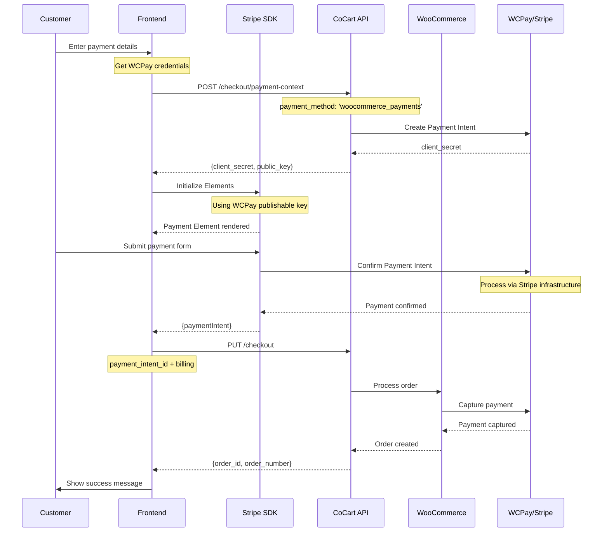

<Warning>
    This tutorial was written by [Claude Code (an AI)](https://claude.com/product/claude-code) and has not yet been reviewed. Follow along with caution. If the tutorial was helpful or a specific part was not clear/correct, please provide feedback at the bottom of the page. Thank you.
</Warning>

<Note>
    This guide covers integrating WooPay (WooCommerce Payments) with CoCart Preview API. Requires CoCart v4.6+ and WooCommerce Payments configured with WooPay enabled.
</Note>

## Overview

WooPay is the express checkout feature of **WooCommerce Payments**, which is built on Stripe's infrastructure. This means you can use the Stripe SDK directly with your WooCommerce Payments account for headless checkout implementations.

<Info>
    This tutorial is specifically for **WooCommerce Payments** users. If you're using the standalone **WooCommerce Stripe Gateway** plugin, see the [Stripe tutorial](/tutorials/pre-release/checkout-stripe) instead. Both use Stripe's infrastructure, but require different payment method IDs.

    **Key Differences**:
    - **WooCommerce Payments**: Available in 39 countries, managed by WooCommerce/Automattic, includes WooPay express checkout. (`payment_method: 'woocommerce_payments'`)
    - **Stripe Gateway**: Available in 45+ countries, direct Stripe integration, full control over Stripe account. (`payment_method: 'stripe'`)

    [View supported countries](https://woocommerce.com/document/woopayments/compatibility/countries/#supported-countries)
</Info>

### Why This Works

WooCommerce Payments operates on Stripe's payment processing infrastructure:
- Your WooCommerce Payments account is a Stripe Connect account
- You can use Stripe.js v3 for client-side payment processing
- All Stripe SDK features are available to you
- Your publishable key starts with `pk_test_` or `pk_live_`

## Prerequisites

Before implementing WooPay checkout, ensure you have:

1. **Supported country** - Your business must be registered in one of the [supported countries](https://woocommerce.com/document/woopayments/compatibility/countries/#supported-countries)
2. WooCommerce Payments plugin installed and configured
3. WooPay enabled in WooCommerce Payments settings
4. A valid cart with items added via CoCart API
5. Customer billing address information
6. Stripe.js v3 loaded in your frontend

## Integration Flow



<Steps>
    <Step title="Get Your Stripe Credentials">
        Extract your Stripe publishable key from WooCommerce Payments
    </Step>
    <Step title="Initialize Stripe SDK">
        Set up Stripe.js with your WooCommerce Payments credentials
    </Step>
    <Step title="Create Payment Elements">
        Build the payment form using Stripe Elements
    </Step>
    <Step title="Collect Payment Details">
        Let customers securely enter payment information
    </Step>
    <Step title="Complete Checkout">
        Submit checkout with payment data to CoCart
    </Step>
</Steps>

## Step 1: Get Your Stripe Credentials

Since WooCommerce Payments runs on Stripe, you need to extract your Stripe publishable key. Choose one of these methods:

### Method A: Admin Notice Helper (Recommended)

Add this temporary code to your `functions.php` or custom plugin:

```php
/**
 * Display WooCommerce Payments Stripe Keys
 * For development purposes only - remove after use
 */
add_action('admin_notices', function() {
    if (!current_user_can('manage_woocommerce')) {
        return;
    }

    if (!class_exists('WC_Payments')) {
        return;
    }

    $account_service = WC_Payments::get_account_service();
    if (!$account_service) {
        return;
    }

    $is_test_mode = WC_Payments::mode()->is_test();
    $publishable_key = $account_service->get_publishable_key($is_test_mode);
    $account_id = $account_service->get_stripe_account_id();

    if ($publishable_key) {
        echo '<div class="notice notice-info is-dismissible">';
        echo '<h3>WooCommerce Payments - Stripe Credentials</h3>';
        echo '<p><strong>Mode:</strong> ' . ($is_test_mode ? 'Test Mode' : 'Live Mode') . '</p>';
        echo '<p><strong>Publishable Key:</strong> <code style="user-select: all;">' . esc_html($publishable_key) . '</code></p>';
        echo '<p><strong>Stripe Account ID:</strong> <code style="user-select: all;">' . esc_html($account_id) . '</code></p>';
        echo '<p><em>⚠️ Remove this code snippet after copying your keys!</em></p>';
        echo '</div>';
    }
});
```

**Steps:**
1. Add the code above to your site temporarily
2. Navigate to WordPress Admin Dashboard
3. Look for the "WooCommerce Payments - Stripe Credentials" notice
4. Copy your **Publishable Key** (starts with `pk_test_` or `pk_live_`)
5. **Important**: Remove the helper code after copying

### Method B: Browser Console (Simpler)

1. Go to your WooCommerce checkout page
2. Press `F12` to open Developer Tools
3. Go to the Console tab
4. Run this command:

```javascript
// Copy publishable key to clipboard
copy(wcpay_upe_config.publishableKey);
console.log('✓ Publishable key copied to clipboard!');
console.log('Account ID:', wcpay_upe_config.accountId);
console.log('Test Mode:', wcpay_upe_config.testMode);
```

<Warning>
**Security Reminders**:
- ✅ Publishable keys are safe to expose client-side (that's their purpose)
- ⚠️ NEVER expose secret/private keys
- 🔒 Always use test mode keys during development (`pk_test_`)
- 🗑️ Remove helper code after obtaining keys
</Warning>

## Step 2: Load Stripe SDK

Add Stripe.js to your frontend application:

```html
<!-- Load Stripe.js v3 -->
<script src="https://js.stripe.com/v3/"></script>
```

Or via npm/yarn if using a build system:

```bash
npm install @stripe/stripe-js
# or
yarn add @stripe/stripe-js
```

```javascript
import { loadStripe } from '@stripe/stripe-js';
```

## Step 3: Initialize Stripe Elements

Set up Stripe with your WooCommerce Payments publishable key:

<Tabs>
    <Tab title="Vanilla JavaScript">
    ```javascript
    // Initialize Stripe with WooCommerce Payments key
    const stripe = Stripe('pk_test_XXXXXXXXXXXXX'); // Your WCPay publishable key
    const elements = stripe.elements();

    // Create card element with custom styling
    const cardElement = elements.create('card', {
        style: {
            base: {
                fontSize: '16px',
                color: '#32325d',
                fontFamily: '-apple-system, BlinkMacSystemFont, "Segoe UI", Roboto, sans-serif',
                '::placeholder': {
                    color: '#aab7c4',
                },
            },
            invalid: {
                color: '#fa755a',
                iconColor: '#fa755a'
            },
        },
        hidePostalCode: false,
    });

    // Mount the card element
    cardElement.mount('#card-element');

    // Handle real-time validation
    cardElement.on('change', ({error}) => {
        const displayError = document.getElementById('card-errors');
        if (error) {
            displayError.textContent = error.message;
            displayError.style.display = 'block';
        } else {
            displayError.textContent = '';
            displayError.style.display = 'none';
        }
    });
    ```
    </Tab>

    <Tab title="React">
    ```javascript
    import { loadStripe } from '@stripe/stripe-js';
    import { Elements, CardElement } from '@stripe/react-stripe-js';

    // Initialize Stripe
    const stripePromise = loadStripe('pk_test_XXXXXXXXXXXXX');

    function CheckoutForm() {
        return (
            <Elements stripe={stripePromise}>
                <div className="payment-form">
                    <CardElement
                        options={{
                            style: {
                                base: {
                                    fontSize: '16px',
                                    color: '#32325d',
                                    '::placeholder': {
                                        color: '#aab7c4',
                                    },
                                },
                                invalid: {
                                    color: '#fa755a',
                                },
                            },
                        }}
                    />
                </div>
            </Elements>
        );
    }
    ```
    </Tab>

    <Tab title="HTML Form">
    ```html
    <form id="payment-form">
        <!-- Billing Information -->
        <div class="form-section">
            <h3>Billing Information</h3>

            <input type="text" name="billing_first_name" placeholder="First Name" required />
            <input type="text" name="billing_last_name" placeholder="Last Name" required />
            <input type="email" name="billing_email" placeholder="Email" required />
            <input type="tel" name="billing_phone" placeholder="Phone" />

            <input type="text" name="billing_address_1" placeholder="Address" required />
            <input type="text" name="billing_city" placeholder="City" required />
            <input type="text" name="billing_state" placeholder="State/Province" required />
            <input type="text" name="billing_postcode" placeholder="Postal Code" required />
            <input type="text" name="billing_country" placeholder="Country" required />
        </div>

        <!-- Stripe Card Element -->
        <div class="form-section">
            <h3>Payment Information</h3>
            <div id="card-element">
                <!-- Stripe Elements will insert the card input here -->
            </div>

            <!-- Display errors -->
            <div id="card-errors" role="alert"></div>
        </div>

        <button type="submit" id="submit-button">
            Complete Order
        </button>
    </form>
    ```
    </Tab>
</Tabs>

## Step 4: Create Payment Method

When the customer submits the form, create a payment method using Stripe:

```javascript
async function handlePaymentSubmission(event) {
    event.preventDefault();

    const form = event.target;
    const submitButton = form.querySelector('#submit-button');

    // Disable submit button
    submitButton.disabled = true;
    submitButton.textContent = 'Processing...';

    try {
        // Collect billing data from form
        const billingData = {
            first_name: form.billing_first_name.value,
            last_name: form.billing_last_name.value,
            email: form.billing_email.value,
            phone: form.billing_phone?.value || '',
            address_1: form.billing_address_1.value,
            city: form.billing_city.value,
            state: form.billing_state.value,
            postcode: form.billing_postcode.value,
            country: form.billing_country.value
        };

        // Create payment method with Stripe
        const {paymentMethod, error} = await stripe.createPaymentMethod({
            type: 'card',
            card: cardElement,
            billing_details: {
                name: `${billingData.first_name} ${billingData.last_name}`,
                email: billingData.email,
                phone: billingData.phone,
                address: {
                    line1: billingData.address_1,
                    city: billingData.city,
                    state: billingData.state,
                    postal_code: billingData.postcode,
                    country: billingData.country,
                }
            },
        });

        if (error) {
            throw new Error(error.message);
        }

        console.log('Payment method created:', paymentMethod.id);

        // Proceed to checkout
        await processCheckout(billingData, paymentMethod);

    } catch (error) {
        console.error('Payment failed:', error);
        document.getElementById('card-errors').textContent = error.message;

        // Re-enable submit button
        submitButton.disabled = false;
        submitButton.textContent = 'Complete Order';
    }
}

// Attach to form
document.getElementById('payment-form').addEventListener('submit', handlePaymentSubmission);
```

## Step 5: Complete Checkout

Process the checkout with CoCart using the payment method:

```javascript
async function processCheckout(billingAddress, paymentMethod) {
    const cartKey = localStorage.getItem('cart_key');

    try {
        const response = await fetch('https://your-store.com/wp-json/cocart/preview/checkout', {
            method: 'PUT',
            headers: {
                'Cart-Key': cartKey,
                'Content-Type': 'application/json',
            },
            body: JSON.stringify({
                billing_address: billingAddress,
                payment_method: 'woocommerce_payments', // Important: use WooCommerce Payments ID
                payment_method_data: {
                    payment_method: paymentMethod.id // Stripe payment method ID
                }
            })
        });

        const result = await response.json();

        if (!response.ok) {
            throw new Error(result.message || 'Checkout failed');
        }

        // Handle successful order
        if (result.order_id) {
            console.log('Order created successfully:', result.order_id);

            // Clear cart
            localStorage.removeItem('cart_key');

            // Show success message
            showSuccessMessage(`Order #${result.order_number} completed!`);

            // Redirect to thank you page
            if (result.payment_result?.redirect_url) {
                setTimeout(() => {
                    window.location.href = result.payment_result.redirect_url;
                }, 2000);
            }
        }

    } catch (error) {
        console.error('Checkout error:', error);
        throw error;
    }
}

function showSuccessMessage(message) {
    const errorElement = document.getElementById('card-errors');
    errorElement.textContent = message;
    errorElement.style.color = '#28a745';
    errorElement.style.display = 'block';
}
```

## Complete Integration Example

Here's a complete, production-ready implementation:

```javascript
class WooPayCheckout {
    constructor(publishableKey) {
        this.stripe = null;
        this.cardElement = null;
        this.publishableKey = publishableKey;
    }

    async initialize() {
        try {
            // Initialize Stripe
            this.stripe = Stripe(this.publishableKey);

            // Create Elements
            const elements = this.stripe.elements();

            // Create and mount card element
            this.cardElement = elements.create('card', {
                style: {
                    base: {
                        fontSize: '16px',
                        color: '#32325d',
                        fontFamily: 'system-ui, sans-serif',
                        '::placeholder': {
                            color: '#aab7c4',
                        },
                    },
                    invalid: {
                        color: '#fa755a',
                        iconColor: '#fa755a',
                    },
                },
                hidePostalCode: false,
            });

            this.cardElement.mount('#card-element');

            // Setup validation
            this.setupValidation();

            // Setup form submission
            this.setupFormSubmission();

            console.log('WooPay checkout initialized');
        } catch (error) {
            console.error('WooPay initialization error:', error);
            this.showError('Payment system unavailable. Please refresh and try again.');
        }
    }

    setupValidation() {
        this.cardElement.on('change', ({error}) => {
            const errorElement = document.getElementById('card-errors');
            if (error) {
                errorElement.textContent = error.message;
                errorElement.style.display = 'block';
            } else {
                errorElement.textContent = '';
                errorElement.style.display = 'none';
            }
        });
    }

    setupFormSubmission() {
        const form = document.getElementById('payment-form');

        form.addEventListener('submit', async (event) => {
            event.preventDefault();
            await this.handleSubmit(form);
        });
    }

    async handleSubmit(form) {
        const submitButton = form.querySelector('#submit-button');
        const originalText = submitButton.textContent;

        try {
            // Disable submit button
            submitButton.disabled = true;
            submitButton.textContent = 'Processing Payment...';

            // Get billing address
            const billingAddress = this.getBillingAddressFromForm(form);

            // Create payment method
            const {paymentMethod, error} = await this.stripe.createPaymentMethod({
                type: 'card',
                card: this.cardElement,
                billing_details: {
                    name: `${billingAddress.first_name} ${billingAddress.last_name}`,
                    email: billingAddress.email,
                    phone: billingAddress.phone,
                    address: {
                        line1: billingAddress.address_1,
                        city: billingAddress.city,
                        state: billingAddress.state,
                        postal_code: billingAddress.postcode,
                        country: billingAddress.country,
                    }
                },
            });

            if (error) {
                throw new Error(error.message);
            }

            // Process checkout
            await this.processCheckout(billingAddress, paymentMethod);

        } catch (error) {
            console.error('Payment error:', error);
            this.showError(error.message || 'Payment failed. Please try again.');
        } finally {
            submitButton.disabled = false;
            submitButton.textContent = originalText;
        }
    }

    getBillingAddressFromForm(form) {
        const formData = new FormData(form);
        return {
            first_name: formData.get('billing_first_name'),
            last_name: formData.get('billing_last_name'),
            email: formData.get('billing_email'),
            phone: formData.get('billing_phone') || '',
            address_1: formData.get('billing_address_1'),
            city: formData.get('billing_city'),
            state: formData.get('billing_state'),
            postcode: formData.get('billing_postcode'),
            country: formData.get('billing_country')
        };
    }

    async processCheckout(billingAddress, paymentMethod) {
        const cartKey = localStorage.getItem('cart_key');

        const response = await fetch('/wp-json/cocart/preview/checkout', {
            method: 'PUT',
            headers: {
                'Cart-Key': cartKey,
                'Content-Type': 'application/json',
            },
            body: JSON.stringify({
                billing_address: billingAddress,
                payment_method: 'woocommerce_payments',
                payment_method_data: {
                    payment_method: paymentMethod.id
                }
            })
        });

        const result = await response.json();

        if (!response.ok) {
            throw new Error(result.message || `Checkout failed (${response.status})`);
        }

        // Handle success
        this.handleCheckoutSuccess(result);

        return result;
    }

    handleCheckoutSuccess(result) {
        this.showSuccess(`Order #${result.order_number} completed successfully!`);

        // Clear cart
        localStorage.removeItem('cart_key');

        // Redirect to thank you page
        if (result.payment_result?.redirect_url) {
            setTimeout(() => {
                window.location.href = result.payment_result.redirect_url;
            }, 2000);
        }
    }

    showError(message) {
        const errorElement = document.getElementById('card-errors');
        errorElement.textContent = message;
        errorElement.style.color = '#fa755a';
        errorElement.style.display = 'block';
    }

    showSuccess(message) {
        const errorElement = document.getElementById('card-errors');
        errorElement.textContent = message;
        errorElement.style.color = '#28a745';
        errorElement.style.display = 'block';
    }
}

// Initialize when DOM is ready
document.addEventListener('DOMContentLoaded', async () => {
    // Replace with your actual WooCommerce Payments publishable key
    const publishableKey = 'pk_test_XXXXXXXXXXXXX';

    const checkout = new WooPayCheckout(publishableKey);
    await checkout.initialize();
});
```

## Error Handling

Handle common WooPay/Stripe errors gracefully:

```javascript
function handlePaymentError(error) {
    let userMessage = 'Payment failed. Please try again.';

    // Map error codes to user-friendly messages
    const errorMessages = {
        'card_declined': 'Your card was declined. Please try a different payment method.',
        'insufficient_funds': 'Insufficient funds. Please use a different card.',
        'expired_card': 'Your card has expired. Please use a different card.',
        'incorrect_cvc': 'The security code is incorrect. Please check and try again.',
        'incorrect_number': 'The card number is incorrect. Please check and try again.',
        'processing_error': 'An error occurred while processing your card. Please try again.',
        'rate_limit': 'Too many requests. Please wait a moment and try again.',
    };

    if (error.code && errorMessages[error.code]) {
        userMessage = errorMessages[error.code];
    } else if (error.message) {
        userMessage = error.message;
    }

    // Display error to user
    const errorElement = document.getElementById('card-errors');
    errorElement.textContent = userMessage;
    errorElement.style.display = 'block';

    // Log for debugging
    console.error('Payment error details:', {
        code: error.code,
        message: error.message,
        type: error.type
    });
}
```

## Testing

### Test Card Numbers

Use Stripe's test cards in test mode:

| Card Number | Scenario |
|------------|----------|
| `4242424242424242` | Successful payment |
| `4000000000000002` | Card declined |
| `4000000000009995` | Insufficient funds |
| `4000000000000069` | Expired card |
| `4000000000000127` | Incorrect CVC |

### Test Details
- **CVC**: Any 3-digit number (4 digits for Amex)
- **Expiry**: Any future date
- **Postal Code**: Any valid postal code

### Enable Test Mode

Ensure WooCommerce Payments is in test mode:
1. Go to **WooCommerce → Settings → Payments**
2. Click **WooCommerce Payments**
3. Check "Enable test mode"
4. Save changes

## WooPay Express Checkout

WooPay also offers express checkout features. To check if WooPay express is enabled:

```javascript
// Available on checkout pages
if (wcpay_upe_config.isWooPayExpressCheckoutEnabled) {
    console.log('WooPay Express is enabled');
    console.log('WooPay Host:', wcpay_upe_config.woopayHost);
}
```

<Note>
WooPay Express Checkout integration is beyond the scope of this tutorial. This guide focuses on standard credit card processing using WooCommerce Payments' Stripe infrastructure.
</Note>

## Best Practices

<CardGroup cols={2}>
    <Card title="Security" icon="shield-check">
    - Never expose secret keys client-side
    - Always use HTTPS in production
    - Validate billing data before submission
    - Use test mode for development
    - Remove helper code from production
    </Card>

    <Card title="User Experience" icon="user">
    - Show loading states during processing
    - Provide clear, specific error messages
    - Enable real-time card validation
    - Support mobile-friendly inputs
    - Display accepted card types
    </Card>

    <Card title="Error Handling" icon="triangle-exclamation">
    - Handle network failures gracefully
    - Log errors for debugging
    - Provide retry mechanisms
    - Never expose technical details to users
    - Test all error scenarios
    </Card>

    <Card title="Performance" icon="gauge-high">
    - Load Stripe.js asynchronously
    - Minimize unnecessary API calls
    - Implement request timeouts
    - Cache publishable keys appropriately
    - Monitor payment processing times
    </Card>
</CardGroup>

## Troubleshooting

### Common Issues

<AccordionGroup>
    <Accordion title="WooCommerce Payments Not Available in My Country">
        **Problem**: Cannot install or activate WooCommerce Payments in your country.

        **Solution**: WooCommerce Payments is available in **39 countries**. If your country is not on this list, use WooCommerce Stripe Gateway instead.

        **WooCommerce Payments Supported Countries** (39):
        Australia, Austria, Belgium, Bulgaria, Canada, Croatia, Cyprus, Czech Republic, Denmark, Estonia, Finland, France, Germany, Greece, Hong Kong, Hungary, Ireland, Italy, Japan, Latvia, Lithuania, Luxembourg, Malta, Netherlands, New Zealand, Norway, Poland, Portugal, Romania, Singapore, Slovakia, Slovenia, Spain, Sweden, Switzerland, UAE, United Kingdom, United States

        **If your country is NOT listed above:**

        **Option 1: Use WooCommerce Stripe Gateway** (Recommended)
        1. Uninstall WooCommerce Payments (if installed)
        2. Install [WooCommerce Stripe Gateway](https://wordpress.org/plugins/woocommerce-gateway-stripe/) plugin
        3. Create a direct Stripe account at [stripe.com](https://stripe.com)
        4. Follow the [Stripe tutorial](/tutorials/pre-release/checkout-stripe) instead
        5. Use `payment_method: 'stripe'` in your checkout code

        **Why Stripe Gateway for unsupported countries?**
        - Available in 45+ countries (more than WooCommerce Payments)
        - Includes additional countries like Brazil, India, Indonesia, Malaysia, Mexico, Thailand
        - Direct control over your Stripe account
        - Same Stripe infrastructure and security
        - Full API access for headless commerce

        **Important Notes**:
        - Your **business registration location** determines eligibility, not your personal residence
        - UAE only supports Business accounts (not Individual accounts)
        - [Check if your country supports WooCommerce Payments](https://woocommerce.com/document/woopayments/compatibility/countries/#supported-countries)
        - [Check if your country supports Stripe directly](https://stripe.com/global)
    </Accordion>

    <Accordion title="'Stripe is not defined' Error">
        **Problem**: Stripe.js hasn't loaded before initialization.

        **Solution**: Wait for the script to load:
        ```javascript
        function loadStripe() {
            return new Promise((resolve) => {
                if (typeof Stripe !== 'undefined') {
                    resolve(Stripe);
                    return;
                }

                const script = document.createElement('script');
                script.src = 'https://js.stripe.com/v3/';
                script.onload = () => resolve(Stripe);
                document.head.appendChild(script);
            });
        }

        // Usage
        const Stripe = await loadStripe();
        const stripe = Stripe('pk_test_xxx');
        ```
    </Accordion>

    <Accordion title="Payment Method Not Accepted">
        **Problem**: Backend doesn't recognize payment method.

        **Solution**: Ensure you're using the correct payment method ID:
        - Use `'woocommerce_payments'` (not `'stripe'`)
        - Verify WooCommerce Payments is enabled and active
        - Check that WooCommerce Payments is configured in test/live mode appropriately
        - **Important**: If your country is not in the 39 supported countries, WooCommerce Payments won't work - use Stripe Gateway instead
    </Accordion>

    <Accordion title="Card Element Not Displaying">
        **Problem**: Card input field doesn't appear.

        **Solution**: Verify the following:
        - Element ID matches: `cardElement.mount('#card-element')`
        - Container exists in DOM before mount
        - No CSS conflicts hiding the element
        - Check browser console for errors
    </Accordion>

    <Accordion title="Publishable Key Not Found">
        **Problem**: Can't retrieve WooCommerce Payments credentials.

        **Solution**:
        - Ensure WooCommerce Payments is fully set up and connected
        - Verify you're on a checkout page when using browser console method
        - Check that WooCommerce Payments is activated (not just installed)
        - Try the admin notice helper method instead
    </Accordion>
</AccordionGroup>

## Additional Resources

- [WooCommerce Payments Documentation](https://woocommerce.com/document/payments/)
- [Stripe Elements Documentation](https://stripe.com/docs/stripe-js)
- [Stripe API Reference](https://stripe.com/docs/api)
- [CoCart Checkout API Reference](/api-reference/pre-release/checkout)
- [Payment Processing Fundamentals](/tutorials/pre-release/checkout-payment-processing)
- [Stripe Gateway Tutorial](/tutorials/pre-release/checkout-stripe) - For standalone Stripe plugin users

<Warning>
Always thoroughly test your WooPay integration in test mode before enabling live payments. Verify that webhooks are configured and orders are being created correctly in WooCommerce.
</Warning>

<Note>
Remember: WooCommerce Payments uses Stripe's infrastructure, so all Stripe documentation and best practices apply to your implementation. The key difference is using `payment_method: 'woocommerce_payments'` when submitting to CoCart's Checkout API.
</Note>
